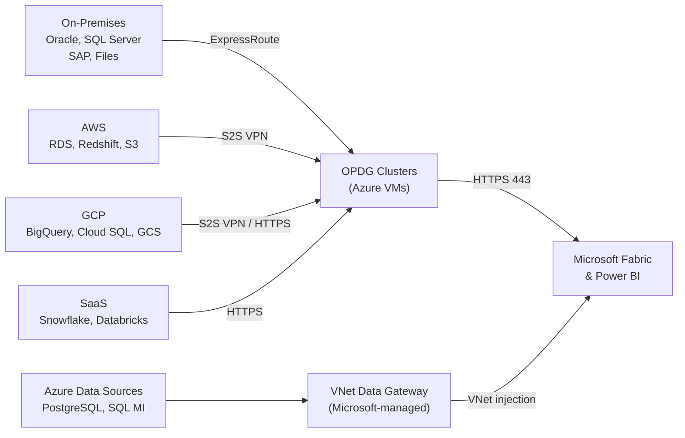

# Data Gateway Architecture for Microsoft Fabric & Power BI

Enterprise-grade, multi-cloud gateway architecture for connecting on-premises, Azure, AWS, GCP, and SaaS data sources to Microsoft Fabric and Power BI.

---

## Overview



This repository contains the **strategy** and **technical architecture** for deploying On-premises Data Gateways (OPDG) and VNet Data Gateways across a multi-region, centrally-managed environment.

## Key Design Decisions

| Decision | Rationale |
|---|---|
| **OPDG for on-prem + multi-cloud** | Only gateway type that supports non-Azure sources (AWS, GCP, Snowflake, etc.) |
| **VNet Data Gateway for Azure PaaS** | Zero VM management; auto-scaling; included in Fabric/Premium cost |
| **Separate Analytics vs. Dataflow clusters** | Prevents noisy-neighbor effects between interactive queries and long-running ETL |
| **3-node HA clusters across Availability Zones** | Automatic failover; stateless nodes; < 1 min RTO |
| **Gateway VMs hosted in Azure** | Simplifies management even for on-prem data via ExpressRoute |

## Scope

### Regions
- **North Europe** (primary)
- **East US** (secondary)
- **France Central** (future)

### Data Sources
| Location | Sources |
|---|---|
| On-premises | Oracle, SQL Server, SAP, File Shares |
| Azure | PostgreSQL (Flexible Server), SQL Managed Instance |
| AWS | RDS (PostgreSQL/MySQL), Redshift, S3 |
| GCP | BigQuery, Cloud SQL, Cloud Storage |
| SaaS | Snowflake, Databricks |

### Workloads
- Power BI Semantic Models (Import & DirectQuery)
- Power BI Dataflows (Gen1 & Gen2)
- Fabric Data Pipelines (Data Factory)
- Fabric Dataflows Gen2
- Fabric Mirroring
- Paginated Reports

## Documentation

| Document | Description |
|---|---|
| [Strategy](docs/01-gateway-strategy.md) | Gateway type selection, governance framework, naming conventions, capacity planning, risk register, success metrics |
| [Architecture](docs/02-gateway-architecture.md) | Technical design — cluster topology, VM specs, network architecture, multi-cloud connectivity, firewall rules, workload routing, HA/DR, monitoring, security, IaC deployment |
| [AWS Connectivity](docs/03-aws-connectivity.md) | Deep dive — all network & identity paths from Fabric to AWS S3, Redshift, and Databricks on AWS; IAM policies, ODBC config, sequence diagrams, security hardening |

## Gateway Type Decision Tree

```
Where is the data source?
├── Azure VNet ──────────► VNet Data Gateway (if workload supports it)
│   └── Paginated Reports / Dataflows Gen1? ──► OPDG Standard
├── On-Premises ─────────► OPDG Standard (via ExpressRoute)
└── Other Cloud / SaaS ──► OPDG Standard (via VPN or HTTPS)
    (AWS, GCP, Snowflake, Databricks, etc.)
```

## Architecture Highlights

### Gateway Clusters (Naming Convention)
```
GW-{ENV}-{REGION}-{PURPOSE}

Examples:
  GW-PROD-NEU-ANALYTICS    → Production BI queries (North Europe)
  GW-PROD-EUS-DATAFLOW     → Production ETL/pipelines (East US)
  GW-NONPROD-NEU           → Dev/Test (North Europe)
```

### Multi-Cloud Connectivity
| Source Cloud | Method | Use When |
|---|---|---|
| AWS (VPC resources) | Site-to-Site VPN or ExpressRoute + Direct Connect | RDS, Redshift in private VPC |
| GCP (VPC resources) | Site-to-Site VPN or ExpressRoute + Cloud Interconnect | Cloud SQL in private VPC |
| BigQuery / Snowflake | Public HTTPS API | API-based services |
| Databricks | Public HTTPS or S2S VPN | Depends on deployment model |

### Availability Targets
| KPI | Target |
|---|---|
| Gateway availability | ≥ 99.5% |
| Refresh success rate | ≥ 98% |
| MTTR (with clustering) | < 30 min |
| Failover (single node) | < 1 min (automatic) |

## Quick Start

1. Read the [Strategy](docs/01-gateway-strategy.md) to understand the "why"
2. Read the [Architecture](docs/02-gateway-architecture.md) for the "how"
3. Follow the implementation checklist in the architecture doc (Appendix A)

## Contributing

This is a reference architecture. To propose changes:
1. Open an issue describing the change
2. Submit a pull request with updates to the relevant doc

## License

Internal reference architecture — adjust as needed for your organization.
