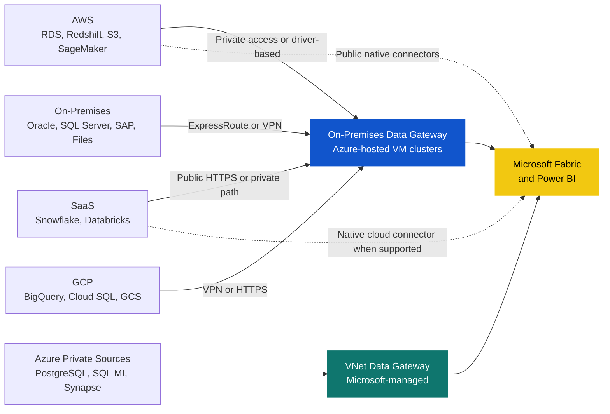

<p align="center">
  
  
  
</p>

<h1 align="center">Fabric Gateway Architecture</h1>

<p align="center">
  <strong>Reference architecture and decision framework for connecting Microsoft Fabric and Power BI to on-premises, Azure, AWS, GCP, and SaaS data sources.</strong>
</p>

<p align="center">
  <a href="#quick-start">Quick Start</a> •
  <a href="#what-this-repo-covers">Scope</a> •
  <a href="#architecture-at-a-glance">Architecture</a> •
  <a href="#design-principles">Principles</a> •
  <a href="#documentation-map">Docs</a>
</p>

---

## Why This Repo Exists

Moving Fabric and Power BI workloads across hybrid and multi-cloud environments gets messy fast: some sources need an On-premises Data Gateway, some should use a VNet Data Gateway, and others can connect directly with native cloud connectors.

This repository gives you a practical architecture for making those decisions consistently across regions, teams, and source systems.

## Architecture At A Glance



## Quick Start

1. Read [docs/01-gateway-strategy.md](docs/01-gateway-strategy.md) for the operating model and gateway selection rules.
2. Read [docs/02-gateway-architecture.md](docs/02-gateway-architecture.md) for the regional design, clusters, network patterns, and component layout.
3. Read [docs/03-aws-connectivity.md](docs/03-aws-connectivity.md) for the AWS deep dive covering S3, Redshift, Databricks on AWS, and SageMaker Unified Studio.

> [!TIP]
> If your immediate question is "Do I need a gateway for this source?", start with [docs/03-aws-connectivity.md](docs/03-aws-connectivity.md) for AWS and [docs/01-gateway-strategy.md](docs/01-gateway-strategy.md) for the general rule set.

## What This Repo Covers

<table>
<tr>
<td width="50%">

### Regions

- North Europe as primary region
- East US as secondary region
- France Central as future expansion or DR option

</td>
<td width="50%">

### Workloads

- Semantic Models: Import and DirectQuery
- Dataflows Gen1 and Gen2
- Fabric Data Pipelines
- Fabric Mirroring
- Paginated Reports

</td>
</tr>
<tr>
<td>

### Source Landscape

- On-premises: Oracle, SQL Server, SAP, file shares
- Azure: PostgreSQL, SQL MI, Synapse private endpoints
- AWS: RDS, Redshift, S3, SageMaker Unified Studio
- GCP: BigQuery, Cloud SQL, Cloud Storage
- SaaS: Snowflake, Databricks

</td>
<td>

### Core Questions Answered

- When to use OPDG vs VNet Data Gateway
- When a native cloud connector is enough
- How to connect AWS privately vs publicly
- How to structure regional gateway clusters
- How to govern credentials, HA, and operations

</td>
</tr>
</table>

---

## Design Principles

| Principle | What it means in practice |
|---|---|
| Use the lightest viable connectivity model | Prefer native cloud connectivity when supported; only introduce a gateway when privacy, drivers, or workload limitations require it |
| Separate analytics from integration | Keep interactive query traffic away from long-running refresh and pipeline workloads |
| Keep gateways regional | Place gateway clusters close to Fabric capacity and close enough to the target source region |
| Design for failure | Use clustered OPDG nodes, stateless routing, and clear failover targets |
| Standardize operations | Shared naming, patching cadence, monitoring, credential rotation, and ownership model |

## Gateway Selection Snapshot

```text
Where is the source?

Azure private endpoint
  -> VNet Data Gateway
  -> If workload limitation exists, fall back to OPDG

On-premises
  -> OPDG

Other cloud or SaaS
  -> If native connector or shortcut is supported and endpoint is public: direct cloud connection
  -> If source is private, driver-based, or connector requires gateway runtime: OPDG
```

## Documentation Map

| Document | Focus | Use it when |
|---|---|---|
| [docs/01-gateway-strategy.md](docs/01-gateway-strategy.md) | Governance, gateway type selection, ownership, security, capacity planning | You need policy, standards, and the decision framework |
| [docs/02-gateway-architecture.md](docs/02-gateway-architecture.md) | Regional layout, gateway clusters, VM sizing, firewall and network design, HA/DR | You need the technical target architecture |
| [docs/03-aws-connectivity.md](docs/03-aws-connectivity.md) | AWS-specific connector behavior, identity models, network options, security hardening | You need AWS implementation guidance |
| [tasks/todo.md](tasks/todo.md) | Lightweight project tracking for this documentation set | You want the current status of the document pack |

---

## Key Decisions

| Decision | Why it matters |
|---|---|
| Azure-hosted OPDG clusters | Centralized management, patching, and monitoring, even when sources are outside Azure |
| Separate analytics and dataflow clusters | Reduces noisy-neighbor behavior and protects user-facing performance |
| Native cloud first where supported | Avoids unnecessary infrastructure for public Redshift, public Databricks, S3 shortcuts, and similar scenarios |
| OPDG for private and driver-based access | Required for private AWS paths, Athena ODBC/DSN scenarios, and workloads that still depend on gateway execution |
| VNet Data Gateway for Azure-native private sources | Simplifies cloud-to-cloud connectivity without VM management |

## Multi-Cloud Connectivity Summary

| Source pattern | Preferred path | Typical examples |
|---|---|---|
| Azure private PaaS | VNet Data Gateway | Azure PostgreSQL, SQL MI, Synapse private endpoints |
| On-premises enterprise systems | OPDG over ExpressRoute or VPN | Oracle, SQL Server, SAP, file shares |
| AWS public services with native support | Direct cloud connector or shortcut | Redshift public endpoint, Databricks public workspace, S3 shortcuts |
| AWS private or DSN-based services | OPDG over VPN or peering | Redshift private VPC, private Databricks, Athena ODBC, private RDS |
| SaaS APIs and public cloud analytics endpoints | Direct HTTPS where supported | Snowflake, BigQuery, public SaaS connectors |

## Availability Targets

| KPI | Target |
|---|---|
| Gateway availability | 99.5% or higher |
| Refresh success rate | 98% or higher |
| Single-node failover | Under 1 minute |
| MTTR with clustering | Under 30 minutes |

---

## Repo Structure

```text
FabricGateway/
├── README.md
├── docs/
│   ├── 01-gateway-strategy.md
│   ├── 02-gateway-architecture.md
│   └── 03-aws-connectivity.md
└── tasks/
    └── todo.md
```

## Contributing

This is a reference architecture repository. Keep changes focused, explicit, and evidence-based.

1. Update the relevant document rather than duplicating guidance in multiple places.
2. Keep connector behavior aligned with current Microsoft documentation.
3. Prefer decision-oriented wording over generic platform descriptions.

## License

Internal reference architecture. Adapt for your organization as needed.
