# Data Gateway Architecture — Technical Design

> **Version**: 1.1  
> **Date**: 2026-03-12  
> **Companion to**: [01-gateway-strategy.md](./01-gateway-strategy.md)  
> **Scope**: Multi-region, multi-cloud On-premises Data Gateway & VNet Data Gateway deployment for Fabric + Power BI  

---

## 1. Architecture Overview

The architecture deploys a **hub-and-spoke gateway model** where each Azure region hosts a self-contained gateway tier, aligned to the Fabric capacity in that region. Gateways are separated by **workload type** (analytics vs. data integration) and **environment** (production vs. non-production).

The design explicitly covers **multi-cloud connectivity** — data sources hosted on AWS, GCP, or other providers connect either through **native cloud connectors** from Fabric / Power BI or through **OPDG clusters in Azure** via Site-to-Site VPN, ExpressRoute partner peering, or secure public endpoints when private or driver-based access is required.

### 1.1 High-Level Architecture Diagram

```mermaid
graph TB
    subgraph "On-Premises Data Center — North Europe"
        ORA_NEU["Oracle DB\n(on-prem)"]
        SQL_NEU["SQL Server\n(on-prem)"]
        SAP_NEU["SAP System"]
        FS_NEU["File Shares\n/ SFTP"]
    end

    subgraph "On-Premises Data Center — East US"
        ORA_EUS["Oracle DB\n(on-prem)"]
        SQL_EUS["SQL Server\n(on-prem)"]
    end

    subgraph "AWS Cloud"
        AWS_RDS["AWS RDS\n(PostgreSQL / MySQL)"]
        AWS_RS["AWS Redshift"]
        AWS_S3["AWS S3"]
        AWS_SM["AWS SageMaker\nUnified Studio"]
    end

    subgraph "GCP Cloud"
        GCP_BQ["GCP BigQuery"]
        GCP_SQL["GCP Cloud SQL"]
        GCP_GCS["GCP Cloud Storage"]
    end

    subgraph "Other Cloud / SaaS"
        SNOW["Snowflake"]
        DBKS["Databricks\n(non-Azure)"]
    end

    subgraph "Azure — North Europe"
        subgraph "Gateway VMs (OPDG Clusters)"
            GW_PROD_NEU_A["GW-PROD-NEU-ANALYTICS\n3-node cluster"]
            GW_PROD_NEU_D["GW-PROD-NEU-DATAFLOW\n3-node cluster"]
            GW_NP_NEU["GW-NONPROD-NEU\n2-node cluster"]
        end

        subgraph "VNet Gateway"
            VGW_NEU["VNet Data Gateway\n(North Europe)"]
        end

        subgraph "Azure Data Sources (VNet)"
            PG_NEU["Azure PostgreSQL\n(Private Endpoint)"]
            ASQL_NEU["Azure SQL MI\n(Private Endpoint)"]
        end

        subgraph "Fabric / Power BI (North Europe)"
            FAB_NEU["Fabric Capacity\nF64+"]
            PBI_NEU["Power BI Premium\nP1+"]
        end
    end

    subgraph "Azure — East US"
        subgraph "Gateway VMs (OPDG Clusters) "
            GW_PROD_EUS_A["GW-PROD-EUS-ANALYTICS\n2-node cluster"]
            GW_PROD_EUS_D["GW-PROD-EUS-DATAFLOW\n2-node cluster"]
        end

        subgraph "VNet Gateway "
            VGW_EUS["VNet Data Gateway\n(East US)"]
        end

        subgraph "Azure Data Sources (VNet) "
            ASQL_EUS["Azure SQL\n(Private Endpoint)"]
        end

        subgraph "Fabric / Power BI (East US)"
            FAB_EUS["Fabric Capacity"]
        end
    end

    %% On-prem to Gateway connections
    ORA_NEU -->|ExpressRoute| GW_PROD_NEU_A
    ORA_NEU -->|ExpressRoute| GW_PROD_NEU_D
    SQL_NEU -->|ExpressRoute| GW_PROD_NEU_A
    SAP_NEU -->|ExpressRoute| GW_PROD_NEU_D
    FS_NEU -->|ExpressRoute| GW_PROD_NEU_D

    ORA_EUS -->|VPN / ExpressRoute| GW_PROD_EUS_A
    SQL_EUS -->|VPN / ExpressRoute| GW_PROD_EUS_D

    %% AWS to Gateway connections
    AWS_RDS -->|S2S VPN / Partner Peering| GW_PROD_NEU_A
    AWS_RS -->|S2S VPN / Partner Peering\n(private) or HTTPS direct\n(public cloud connector)| GW_PROD_EUS_D
    AWS_S3 -->|HTTPS public endpoint\nor direct shortcut| GW_PROD_NEU_D
    AWS_SM -->|Athena ODBC via OPDG\nor S3 direct access| GW_PROD_EUS_D

    %% GCP to Gateway connections
    GCP_BQ -->|HTTPS public API| GW_PROD_NEU_A
    GCP_SQL -->|S2S VPN / Partner Peering| GW_PROD_NEU_D
    GCP_GCS -->|HTTPS public endpoint| GW_PROD_NEU_D

    %% SaaS to Gateway connections
    SNOW -->|HTTPS public endpoint| GW_PROD_EUS_A
    DBKS -->|HTTPS public endpoint| GW_PROD_EUS_D

    %% VNet Gateway to Azure sources
    PG_NEU --> VGW_NEU
    ASQL_NEU --> VGW_NEU
    ASQL_EUS --> VGW_EUS

    %% Direct cloud connector paths
    AWS_RS -.->|Public cloud connector| FAB_EUS
    DBKS -.->|Public cloud connector| FAB_EUS
    AWS_S3 -.->|Shortcut / connector| FAB_NEU

    %% Gateway to Fabric
    GW_PROD_NEU_A -->|HTTPS 443| FAB_NEU
    GW_PROD_NEU_A -->|HTTPS 443| PBI_NEU
    GW_PROD_NEU_D -->|HTTPS 443| FAB_NEU
    VGW_NEU -->|VNet injection| FAB_NEU
    VGW_NEU -->|VNet injection| PBI_NEU

    GW_PROD_EUS_A -->|HTTPS 443| FAB_EUS
    GW_PROD_EUS_D -->|HTTPS 443| FAB_EUS
    VGW_EUS -->|VNet injection| FAB_EUS

    %% Non-prod
    ORA_NEU -.->|ExpressRoute| GW_NP_NEU
    SQL_NEU -.->|ExpressRoute| GW_NP_NEU
    GW_NP_NEU -.->|HTTPS 443| FAB_NEU
```

---

## 2. Detailed Component Architecture

### 2.1 On-Premises Data Gateway (OPDG) Cluster Design

#### 2.1.1 Cluster Topology

Each OPDG cluster runs as an **active-active** set of gateway nodes. The Fabric/Power BI service distributes requests across healthy nodes using round-robin with health checks.

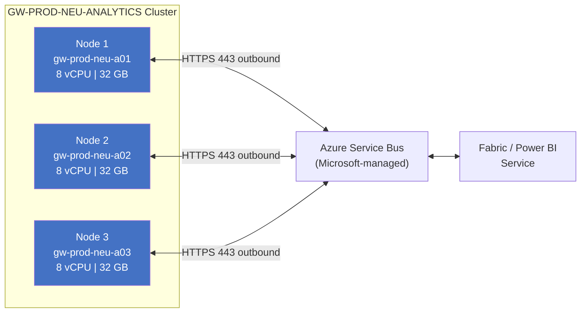

**Key design decisions**:
- **Minimum 2 nodes** for HA (3 recommended for production)
- **All nodes same version** — enforce via automated update policy
- **No affinity** — any node can serve any request; stateless design
- **Load distribution** — managed by Microsoft's gateway cloud service
- **Primary node** — first installed node; used for configuration changes only (not traffic preference)

#### 2.1.2 VM Specifications

| Cluster | VM SKU (Azure) | vCPU | RAM | OS Disk | Data Disk | OS |
|---|---|---|---|---|---|---|
| PROD-ANALYTICS | Standard_D8s_v5 | 8 | 32 GB | 128 GB P10 | 256 GB P15 | Windows Server 2022 |
| PROD-DATAFLOW | Standard_D8s_v5 | 8 | 32 GB | 128 GB P10 | 256 GB P15 | Windows Server 2022 |
| NONPROD | Standard_D4s_v5 | 4 | 16 GB | 128 GB P10 | 128 GB P10 | Windows Server 2022 |

> **Why Azure VMs for OPDG?** Even for on-prem data, placing the gateway VM in Azure (connected via ExpressRoute to on-prem) simplifies management, patching, and monitoring. The gateway only needs outbound access to data sources (via ExpressRoute) and to Azure Service Bus (via internet/service endpoints).

#### 2.1.3 Gateway Software Stack

Each gateway VM runs:

| Component | Version / Detail |
|---|---|
| On-premises Data Gateway | Latest (auto-update enabled, monthly cadence) |
| .NET Framework | 4.8+ (pre-installed on Windows Server 2022) |
| Oracle Client | Oracle Instant Client 21c (for Oracle connectivity) |
| PostgreSQL ODBC/OLE DB | npgsql or PostgreSQL ODBC driver |
| SAP .NET Connector | SAP NCo 3.1 (for SAP RFC/BAPI) |
| Amazon Redshift ODBC | Latest (for private Redshift connectivity via OPDG) |
| Amazon Athena ODBC | Latest (for SageMaker Unified Studio / Athena connectivity) |
| Simba BigQuery ODBC | Latest (for GCP BigQuery connectivity) |
| Snowflake ODBC | Latest (for Snowflake connectivity) |
| Databricks ODBC/Spark | Latest (for private Databricks connectivity via OPDG) |
| MySQL ODBC (Connector/ODBC) | 8.x (for AWS RDS MySQL, GCP Cloud SQL MySQL) |
| Azure Monitor Agent | For VM-level metrics and logs |

### 2.2 VNet Data Gateway Design

#### 2.2.1 Architecture

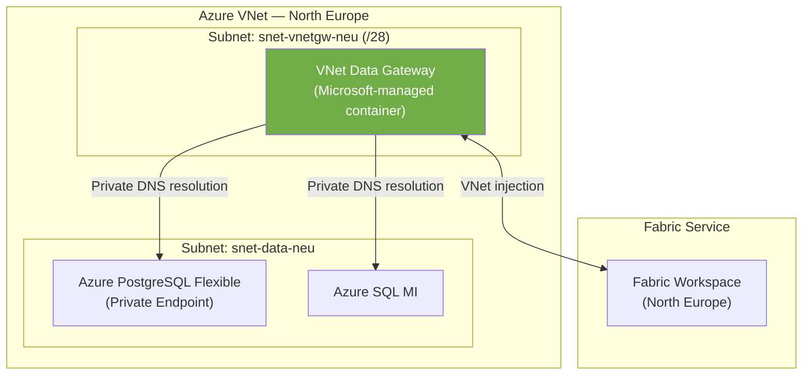

**Key design decisions**:
- **Dedicated subnet** with `/28` minimum (Microsoft requirement for delegation)
- **Subnet delegation** to `Microsoft.PowerPlatform/vnetaccesslinks`
- **No NSG restrictions** on delegated subnet (Microsoft-managed traffic)
- **Private DNS zones** configured for `privatelink.postgres.database.azure.com`, etc.
- **No VM to manage** — Microsoft handles compute, patching, scaling
- **Billing**: Included with Fabric/Premium capacity (no extra cost)

#### 2.2.2 VNet Gateway Limitations (Design Impact)

| Limitation | Workaround |
|---|---|
| No Paginated Reports support | Use OPDG cluster for paginated reports connecting to same sources |
| No Power BI Dataflows Gen1 | Use OPDG or migrate to Dataflows Gen2 |
| Max 5 VNet gateways per tenant | Plan allocations carefully; one per region is typical |
| No on-premises source connectivity | OPDG required for anything outside Azure VNet |
| No cross-cloud connectivity | OPDG required for AWS, GCP, Snowflake, Databricks, and any non-Azure cloud source |

---

## 3. Network Architecture

### 3.1 Network Flow Diagram

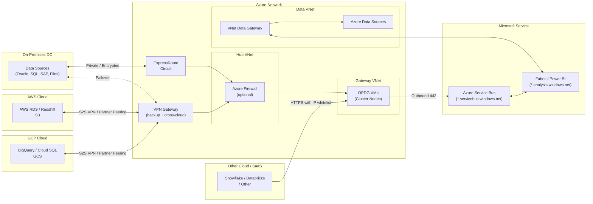

### 3.2 Multi-Cloud Connectivity Patterns

| Source Cloud | Connectivity Method | Description | Latency | Security |
|---|---|---|---|---|
| **AWS (VPC-hosted)** | Azure VPN GW ↔ AWS VGW (S2S VPN) | IPsec tunnels between Azure VNet and AWS VPC | 10-30 ms (same geo) | Encrypted tunnel; no public exposure |
| **AWS (VPC-hosted)** | ExpressRoute + Megaport/Equinix ↔ AWS Direct Connect | Private peering through colocation provider | 3-10 ms | Private circuit; highest bandwidth |

> For a comprehensive deep-dive on AWS S3, Redshift, and Databricks connectivity (identity models, IAM policies, ODBC config, sequence diagrams), see **[03-aws-connectivity.md](./03-aws-connectivity.md)**.

| **GCP (VPC-hosted)** | Azure VPN GW ↔ GCP Cloud VPN (S2S VPN) | IPsec tunnels between Azure VNet and GCP VPC | 10-30 ms (same geo) | Encrypted tunnel; no public exposure |
| **GCP (VPC-hosted)** | ExpressRoute + Partner ↔ GCP Cloud Interconnect | Private peering through colocation provider | 3-10 ms | Private circuit; highest bandwidth |
| **GCP BigQuery** | Public HTTPS API | BigQuery is API-only; no VPC peering needed | Variable | TLS 1.2+; OAuth 2.0; IP whitelist |
| **Snowflake** | Public HTTPS endpoint | Snowflake uses HTTPS endpoints natively | Variable | TLS 1.2+; key-pair auth; IP whitelist |
| **Databricks (non-Azure)** | Public HTTPS endpoint or S2S VPN | Depends on deployment model | Variable | TLS 1.2+; PAT or OAuth |
| **AWS S3 / GCP GCS** | Public HTTPS API | Object storage APIs | Variable | TLS 1.2+; IAM keys; IP whitelist |

#### Cross-Cloud Network Topology

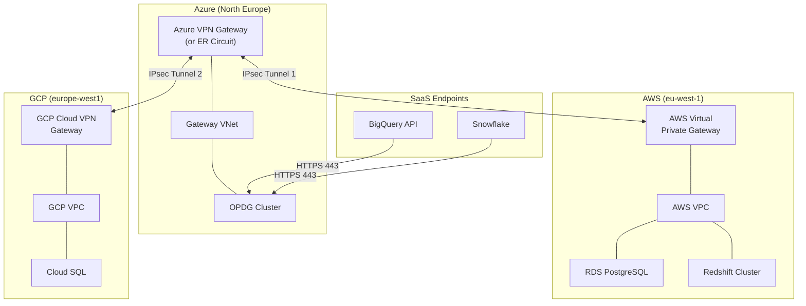

### 3.3 Firewall & NSG Rules (OPDG)

#### Outbound Rules (Required)

| Priority | Destination | Port | Protocol | Purpose |
|---|---|---|---|---|
| 100 | `*.servicebus.windows.net` | 443 | HTTPS | Gateway cloud service relay |
| 110 | `login.microsoftonline.com` | 443 | HTTPS | Entra ID authentication |
| 120 | `*.msftncsi.com` | 443 | HTTPS | Network connectivity check |
| 130 | `*.microsoft.com` | 443 | HTTPS | Gateway updates (download.microsoft.com) |
| 140 | `*.powerbi.com` | 443 | HTTPS | Power BI service telemetry |
| 150 | `*.analysis.windows.net` | 443 | HTTPS | Analysis Services protocol |
| 160 | `*.frontend.clouddatahub.net` | 443 | HTTPS | Fabric Data Factory |
| 170 | `graph.microsoft.com` | 443 | HTTPS | Microsoft Graph — group membership, SPN resolution, entitlements |
| 175 | `*.login.microsoft.com` | 443 | HTTPS | Entra ID token renewal (MSAL fallback) |
| 180 | `login.windows.net` | 443 | HTTPS | Legacy AAD token endpoint (some drivers still use it) |
| 185 | `*.aadcdn.msftauth.net` | 443 | HTTPS | Entra ID CDN — auth libraries JS/CSS (needed for OAuth2 flows) |
| 190 | `*.onelake.dfs.fabric.microsoft.com` | 443 | HTTPS | OneLake DFS — Shortcut read/write to Lakehouse & Warehouse files |
| 195 | `*.blob.core.windows.net` | 443 | HTTPS | ADLS Gen2 / Blob Storage — Shortcut target (Azure storage accounts) |
| 196 | `*.dfs.core.windows.net` | 443 | HTTPS | ADLS Gen2 DFS endpoint — Shortcut target (hierarchical namespace) |
| 197 | `*.s3.amazonaws.com` | 443 | HTTPS | Amazon S3 — Shortcut target (cross-cloud) |
| 198 | `storage.googleapis.com` | 443 | HTTPS | Google Cloud Storage — Shortcut target (cross-cloud) |
| 199 | `*.dataverse.dynamics.com` | 443 | HTTPS | Dataverse — Shortcut target (Dynamics 365 / Power Platform) |
| 200 | `*.datawarehouse.fabric.microsoft.com` | 1433 | TDS | Fabric SQL Endpoint (Lakehouse & Warehouse) |
| 210 | `*.database.windows.net` | 1433 | TDS | Azure SQL Database (Mirroring source, direct queries) |
| 220 | `*.pbidedicated.windows.net` | 1433 | TDS | Fabric / Power BI Premium XMLA endpoint |
| 300 | `*.servicebus.windows.net` | 5671-5672 | AMQP | Service Bus optimised transport (falls back to 443) |

> **Port 1433 for Fabric workloads**: Several Fabric capabilities communicate over TDS (port 1433) rather than HTTPS:
> - **Fabric Lakehouse / Warehouse SQL Endpoint** — Power BI DirectQuery and Import against the SQL analytics endpoint use TDS on 1433 (`*.datawarehouse.fabric.microsoft.com`).
> - **Fabric Mirroring** — when mirroring Azure SQL Database into Fabric, the gateway reads change-feed data over TDS on 1433 (`*.database.windows.net`).
> - **XMLA Endpoint** — external tools (Tabular Editor, DAX Studio) connecting through the gateway use TDS on 1433 (`*.pbidedicated.windows.net`).
> - **AMQP 5671-5672** — the gateway can use AMQP for higher-throughput relay communication with Azure Service Bus. If these ports are blocked, the gateway transparently falls back to HTTPS 443.
>
> Without port 1433 outbound, these workloads will fail with connection-timeout errors even though the gateway appears healthy on port 443.

> **Identity & Entra ID endpoints**: The gateway performs identity operations beyond the initial login:
> - **Microsoft Graph** (`graph.microsoft.com`) — resolves security-group membership for RLS, validates service-principal entitlements, and fetches user metadata for delegated OAuth2 connections.
> - **MSAL / legacy AAD** (`*.login.microsoft.com`, `login.windows.net`, `*.aadcdn.msftauth.net`) — token acquisition, renewal, and Conditional Access evaluation. Some ODBC/OLEDB drivers still call the legacy `login.windows.net` endpoint.
>
> If Graph is blocked, group-based RLS and SPN-based connections will fail silently or return empty results. If MSAL endpoints are blocked, OAuth2 data-source credentials cannot be refreshed.

> **OneLake Shortcuts**: Fabric Shortcuts let a Lakehouse or Warehouse reference external data as if it were local. When the gateway is involved (e.g., Shortcut through a VNet or on-prem path), it must reach the Shortcut target:
> - **OneLake DFS** (`*.onelake.dfs.fabric.microsoft.com`) — intra-Fabric shortcuts between workspaces.
> - **ADLS Gen2** (`*.blob.core.windows.net`, `*.dfs.core.windows.net`) — Azure storage-account shortcuts.
> - **Amazon S3** (`*.s3.amazonaws.com`) — cross-cloud shortcuts to AWS buckets.
> - **Google Cloud Storage** (`storage.googleapis.com`) — cross-cloud shortcuts to GCS buckets.
> - **Dataverse** (`*.dataverse.dynamics.com`) — shortcuts to Dynamics 365 / Power Platform tables.
>
> Shortcuts that target private-endpoint-protected storage also require the corresponding Private DNS zone (see § 3.4).

#### Outbound Rules to Data Sources (via ExpressRoute / VPN / Internet)

| Direction | Source | Destination | Port | Purpose |
|---|---|---|---|---|
| Outbound from GW | OPDG subnet | Oracle DB (on-prem) | 1521 | Oracle TNS |
| Outbound from GW | OPDG subnet | SQL Server (on-prem) | 1433 | TDS |
| Outbound from GW | OPDG subnet | SAP System (on-prem) | 3300-3399 | SAP RFC |
| Outbound from GW | OPDG subnet | File Share (on-prem) | 445 | SMB |
| Outbound from GW | OPDG subnet | PostgreSQL (on-prem/cloud) | 5432 | PostgreSQL |
| Outbound from GW | OPDG subnet | AWS RDS (via VPN) | 3306/5432 | MySQL / PostgreSQL |
| Outbound from GW | OPDG subnet | AWS Redshift (via VPN) | 5439 | Redshift |
| Outbound from GW | OPDG subnet | GCP Cloud SQL (via VPN) | 3306/5432 | MySQL / PostgreSQL |
| Outbound from GW | OPDG subnet | `*.bigquery.cloud.google.com` | 443 | BigQuery API |
| Outbound from GW | OPDG subnet | `*.snowflakecomputing.com` | 443 | Snowflake |
| Outbound from GW | OPDG subnet | `*.cloud.databricks.com` | 443 | Databricks |
| Outbound from GW | OPDG subnet | `*.amazonaws.com` | 443 | AWS S3 / other APIs |

### 3.4 DNS Requirements

| Zone | Records | Purpose |
|---|---|---|
| `privatelink.postgres.database.azure.com` | A records for Azure PG instances | VNet Gateway → Azure PostgreSQL |
| `privatelink.database.windows.net` | A records for Azure SQL | VNet Gateway → Azure SQL |
| `*.datawarehouse.fabric.microsoft.com` | CNAME / A for Fabric SQL endpoints | OPDG / VNet GW → Fabric Lakehouse & Warehouse SQL endpoint (1433) |
| `*.pbidedicated.windows.net` | CNAME / A for XMLA endpoints | OPDG → Fabric / Power BI Premium XMLA endpoint (1433) |
| `*.onelake.dfs.fabric.microsoft.com` | CNAME / A for OneLake DFS | OPDG / VNet GW → OneLake Shortcut read/write |
| `privatelink.blob.core.windows.net` | A records for storage accounts | VNet GW → ADLS Gen2 Blob endpoints (Shortcuts via private endpoint) |
| `privatelink.dfs.core.windows.net` | A records for storage accounts | VNet GW → ADLS Gen2 DFS endpoints (Shortcuts via private endpoint) |
| `graph.microsoft.com` | CNAME / A | OPDG → Microsoft Graph (identity resolution) |
| On-prem DNS | A records for Oracle, SQL Server hosts | OPDG → on-prem data sources |
| AWS private hosted zone (via VPN) | A records for RDS, Redshift endpoints | OPDG → AWS data sources (forwarded via Azure DNS Private Resolver) |
| GCP private DNS (via VPN) | A records for Cloud SQL instances | OPDG → GCP data sources (forwarded via Azure DNS Private Resolver) |
| Public DNS | CNAME/A for BigQuery, Snowflake, Databricks, S3 | OPDG → SaaS endpoints (resolved via default Azure DNS) |

---

## 4. Workload-to-Gateway Routing

### 4.1 Routing Matrix

| Workload | Data Source Location | Gateway Type | Gateway Cluster |
|---|---|---|---|
| Semantic Model — Import Refresh | On-premises Oracle | OPDG | GW-PROD-{region}-ANALYTICS |
| Semantic Model — DirectQuery | On-premises SQL Server | OPDG | GW-PROD-{region}-ANALYTICS |
| Semantic Model — Import Refresh | Azure PostgreSQL (VNet) | VNet GW | VNet-GW-{region} |
| Semantic Model — Import Refresh | AWS RDS PostgreSQL | OPDG | GW-PROD-{region}-ANALYTICS |
| Semantic Model — DirectQuery | Snowflake | OPDG | GW-PROD-{region}-ANALYTICS |
| Semantic Model — Import Refresh | GCP BigQuery | OPDG | GW-PROD-{region}-ANALYTICS |
| Paginated Report | On-premises Oracle | OPDG | GW-PROD-{region}-ANALYTICS |
| Paginated Report | Azure PostgreSQL (VNet) | OPDG* | GW-PROD-{region}-ANALYTICS |
| Paginated Report | AWS RDS / Snowflake | OPDG | GW-PROD-{region}-ANALYTICS |
| Dataflow Gen1 | On-premises SQL Server | OPDG | GW-PROD-{region}-DATAFLOW |
| Dataflow Gen2 | On-premises Oracle | OPDG | GW-PROD-{region}-DATAFLOW |
| Dataflow Gen2 | Azure PostgreSQL (VNet) | VNet GW | VNet-GW-{region} |
| Dataflow Gen2 | AWS Redshift | OPDG | GW-PROD-{region}-DATAFLOW |
| Dataflow Gen2 | GCP Cloud SQL | OPDG | GW-PROD-{region}-DATAFLOW |
| Fabric Pipeline | On-premises Oracle | OPDG | GW-PROD-{region}-DATAFLOW |
| Fabric Pipeline | Azure SQL MI (VNet) | VNet GW | VNet-GW-{region} |
| Fabric Pipeline | AWS RDS / Redshift | OPDG | GW-PROD-{region}-DATAFLOW |
| Fabric Pipeline | Snowflake / Databricks | OPDG | GW-PROD-{region}-DATAFLOW |
| Fabric Mirroring | On-premises SQL Server | OPDG | GW-PROD-{region}-DATAFLOW |
| Fabric Mirroring | Azure SQL (VNet) | VNet GW | VNet-GW-{region} |

> *Paginated Reports cannot use VNet Gateway — even for Azure VNet sources, OPDG is required.  
> **Multi-cloud sources always route through OPDG** — VNet Data Gateway has no cross-cloud or cross-provider capability.

### 4.2 Workload Isolation Rationale

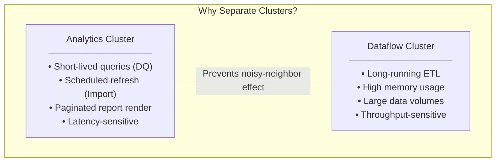

---

## 5. High Availability & Disaster Recovery

### 5.1 HA Design

| Component | HA Mechanism | RPO | RTO |
|---|---|---|---|
| OPDG Cluster | Active-active clustering (3 nodes) | 0 (stateless) | < 1 min (automatic failover) |
| VNet Data Gateway | Microsoft-managed (auto-heal) | 0 | < 5 min |
| ExpressRoute | Redundant circuits + VPN failover | 0 | < 10 min |
| Gateway VM | Azure Availability Set or Zone | N/A | < 5 min (auto-restart) |

### 5.2 HA Topology

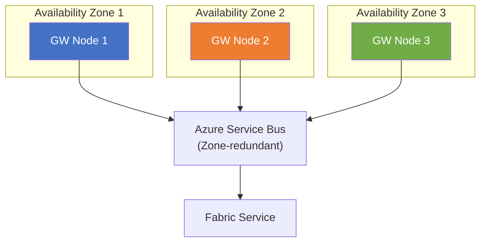

**Key HA rules**:
- Spread gateway nodes across **Azure Availability Zones** (not just availability sets)
- All nodes must run the **same gateway version**
- Cluster automatically redistributes load if a node goes offline
- **Recovery key** stored in Azure Key Vault — required to add nodes or recover cluster

### 5.3 DR Strategy

| Scenario | Strategy |
|---|---|
| **Single node failure** | Automatic — remaining nodes absorb load |
| **Full region outage** | Fabric capacity fails over to paired region; gateway cluster in secondary region takes over |
| **ExpressRoute failure** | Automatic failover to VPN; if both fail, queue refreshes until restored |
| **Gateway corruption** | Reinstall from scratch; join cluster using recovery key from Key Vault |

### 5.4 Cross-Region DR Flow

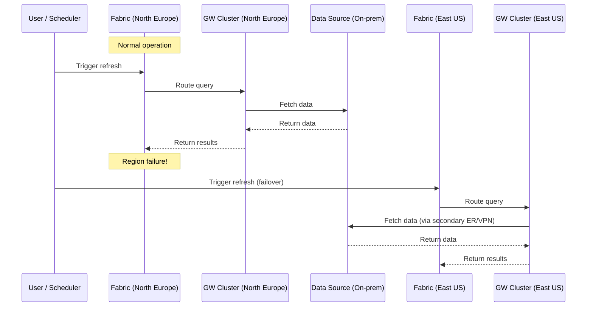

---

## 6. Monitoring & Operations

### 6.1 Monitoring Stack

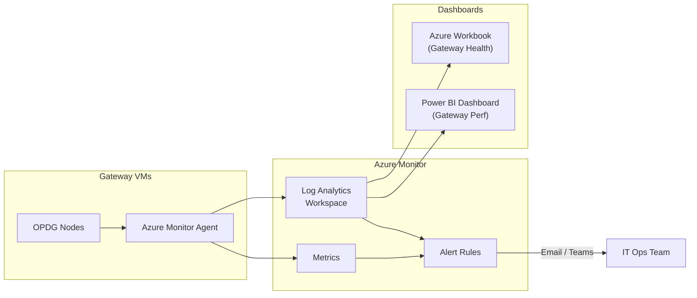

### 6.2 Key Metrics to Monitor

| Metric | Source | Alert Threshold |
|---|---|---|
| Gateway node online status | Fabric Admin API / Gateway REST API | Any node offline > 5 min |
| CPU utilization per node | Azure Monitor (VM metrics) | > 80% sustained 15 min |
| Memory utilization per node | Azure Monitor (VM metrics) | > 85% sustained 15 min |
| Query duration (P95) | Gateway logs (Log Analytics) | > 300s for import, > 30s for DQ |
| Concurrent queries | Gateway performance counters | > 30 per node |
| Refresh failures | Power BI REST API / Fabric API | > 5% failure rate per day |
| Gateway version | Gateway logs / REST API | Version drift > 1 month |
| Disk space | Azure Monitor (VM metrics) | < 20% free |

### 6.3 Alerting Rules

| Alert | Severity | Action |
|---|---|---|
| Gateway node offline | Sev 1 | Auto-page IT Ops; check VM health |
| All nodes offline (cluster down) | Sev 0 | Immediate escalation; trigger DR runbook |
| CPU > 90% for 30 min | Sev 2 | Add node to cluster or scale VM |
| Refresh failure spike | Sev 2 | Investigate data source / credential / timeout |
| Gateway version outdated > 2 months | Sev 3 | Schedule maintenance window for update |

### 6.4 Operational Runbooks

| Runbook | Trigger | Steps |
|---|---|---|
| **Add a cluster node** | Capacity threshold | 1. Deploy VM from template 2. Install gateway 3. Join cluster with recovery key 4. Validate in admin portal |
| **Gateway version update** | Monthly release | 1. Update non-prod first 2. Validate for 48h 3. Rolling update prod (one node at a time) 4. Verify cluster health |
| **Credential rotation** | Every 90 days | 1. Update credentials in gateway config 2. Test all connections 3. Confirm no refresh failures |
| **Cluster recovery** | Node corruption | 1. Remove failed node from cluster 2. Reprovision VM 3. Reinstall gateway 4. Rejoin cluster |

---

## 7. Deployment Architecture (Infrastructure as Code)

### 7.1 Resource Organization

```
Subscription: sub-fabric-gateway-prod
├── Resource Group: rg-gateway-neu-prod
│   ├── VM: vm-gw-prod-neu-a01, a02, a03 (Analytics cluster)
│   ├── VM: vm-gw-prod-neu-d01, d02, d03 (Dataflow cluster)
│   ├── VM: vm-gw-nonprod-neu-01, 02 (Non-prod)
│   ├── NSG: nsg-gateway-neu
│   ├── VNet: vnet-gateway-neu (peered to hub)
│   └── Key Vault: kv-gateway-neu
├── Resource Group: rg-gateway-eus-prod
│   ├── VM: vm-gw-prod-eus-a01, a02 (Analytics cluster)
│   ├── VM: vm-gw-prod-eus-d01, d02 (Dataflow cluster)
│   ├── NSG: nsg-gateway-eus
│   ├── VNet: vnet-gateway-eus (peered to hub)
│   └── Key Vault: kv-gateway-eus
└── Resource Group: rg-vnetgateway-prod
    ├── VNet Gateway: vnetgw-neu (delegated subnet in data VNet)
    └── VNet Gateway: vnetgw-eus (delegated subnet in data VNet)
```

### 7.2 Deployment Pipeline

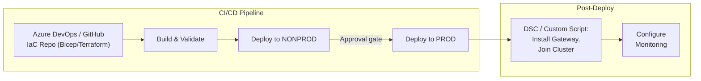

---

## 8. Security Architecture

### 8.1 Identity & Access

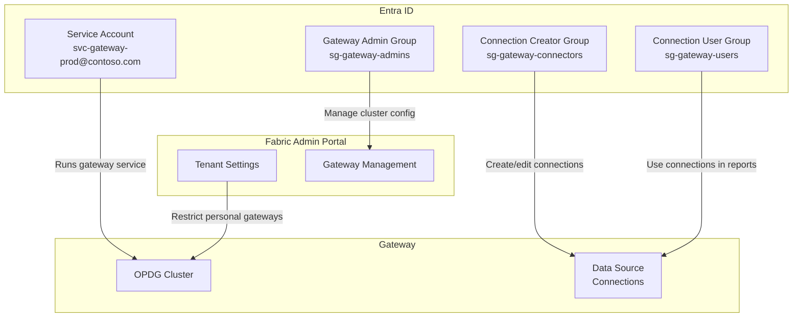

### 8.2 Data in Transit & At Rest

| Layer | Protection |
|---|---|
| Gateway ↔ Azure Service Bus | TLS 1.2+, certificate pinning |
| Gateway ↔ On-prem data source | Encrypted via source protocol (TDS/TNS with encryption) + ExpressRoute encryption |
| Gateway ↔ AWS/GCP data source (VPN) | IPsec tunnel (AES-256) via Site-to-Site VPN; double-encrypted |
| Gateway ↔ SaaS endpoints (Snowflake, BigQuery, Databricks) | TLS 1.2+ over public internet; IP whitelisting on both sides |
| Credentials stored in gateway | AES-256 encrypted with gateway recovery key |
| Recovery key | Stored in Azure Key Vault (HSM-backed) |
| AWS IAM keys / GCP service account keys | Stored in Azure Key Vault; referenced by gateway connections; 90-day rotation |
| VM disks | Azure Disk Encryption (BitLocker) with platform-managed keys |

---

## 9. Migration Path (Oracle → PostgreSQL Context)

Since this gateway architecture supports the broader Oracle-to-PostgreSQL migration:

| Phase | Gateway Role |
|---|---|
| **Phase 1: Dual-source** | OPDG serves both Oracle (on-prem) and PostgreSQL (Azure VNet via VNet GW) simultaneously |
| **Phase 2: Cutover** | Reports/dataflows switched from Oracle connections to PostgreSQL connections |
| **Phase 3: Decommission** | Oracle connections removed from gateway; Oracle drivers optionally uninstalled |

> During dual-source phase, both gateway types operate in parallel. No gateway reconfiguration needed — only connection-level changes in Fabric/Power BI.

---

## 10. Summary — Full Architecture at a Glance

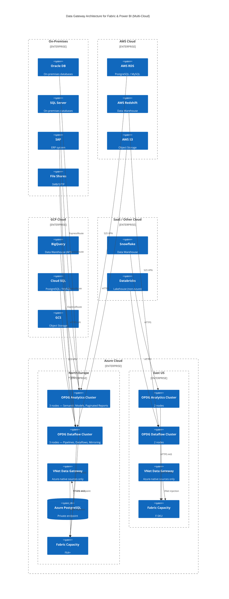

---

## Appendix A: Checklist for Implementation

- [ ] Provision Azure VMs in each region (per sizing table)
- [ ] Configure VNet peering (gateway VNet ↔ hub VNet ↔ data VNet)
- [ ] Install OPDG on all VMs; form clusters using recovery key
- [ ] Configure cross-cloud VPN tunnels (Azure VPN GW ↔ AWS VGW, Azure VPN GW ↔ GCP Cloud VPN)
- [ ] Install multi-cloud ODBC drivers (Redshift, BigQuery, Snowflake, Databricks, MySQL)
- [ ] Configure DNS forwarding for AWS/GCP private DNS zones (Azure DNS Private Resolver)
- [ ] Store AWS IAM keys and GCP service account keys in Azure Key Vault
- [ ] Whitelist OPDG subnet public IPs on SaaS endpoints (Snowflake, BigQuery, Databricks)
- [ ] Configure data source connections (Oracle, SQL, SAP, files, AWS, GCP, Snowflake, Databricks)
- [ ] Create VNet Data Gateways with subnet delegation
- [ ] Configure private DNS zones for Azure PaaS services
- [ ] Set up Azure Monitor agent and Log Analytics workspace
- [ ] Create alert rules (node offline, CPU, memory, refresh failures)
- [ ] Disable personal gateways in Fabric Admin Portal
- [ ] Configure RBAC (admin, connection creator, connection user groups)
- [ ] Store recovery keys in Azure Key Vault
- [ ] Test HA: shut down one node, verify automatic failover
- [ ] Test DR: simulate region failure, verify secondary region handles load
- [ ] Document runbooks and share with IT Ops team
- [ ] Schedule monthly gateway version update process

---

> **Next**: Implementation begins with infrastructure provisioning. Refer to the checklist above and the deployment pipeline in Section 7.2.
