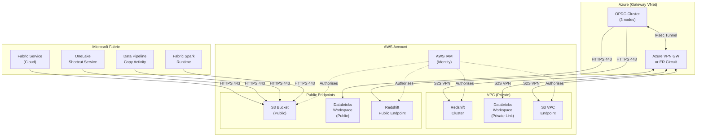
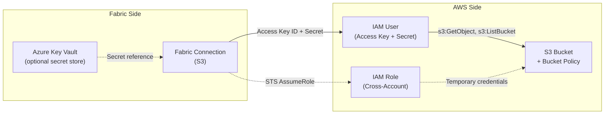
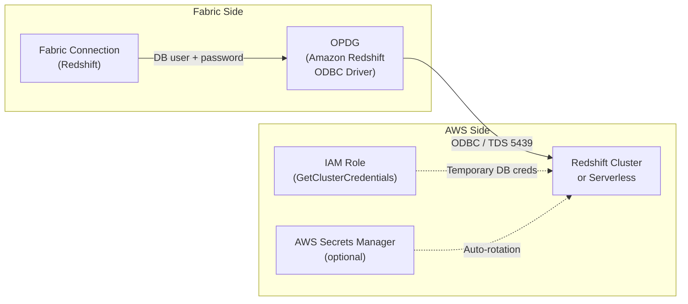
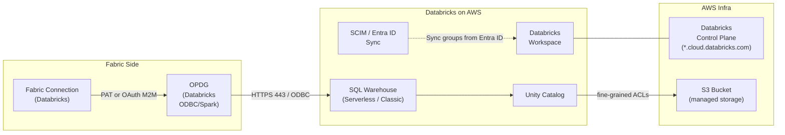
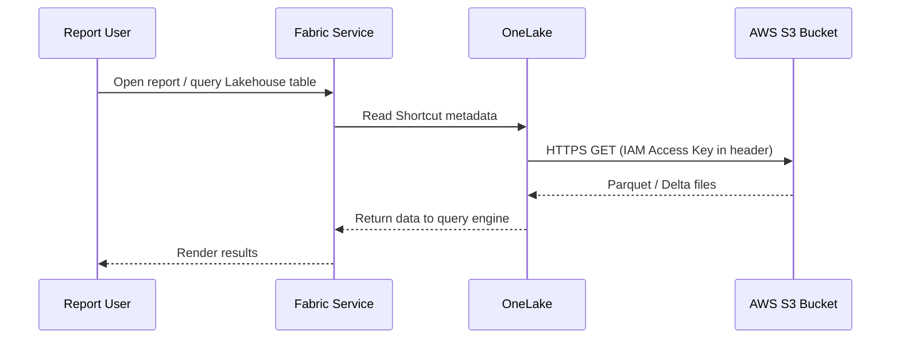
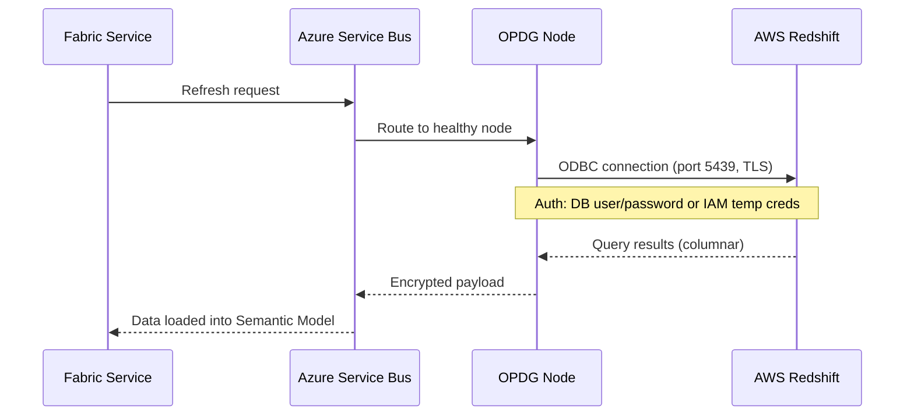
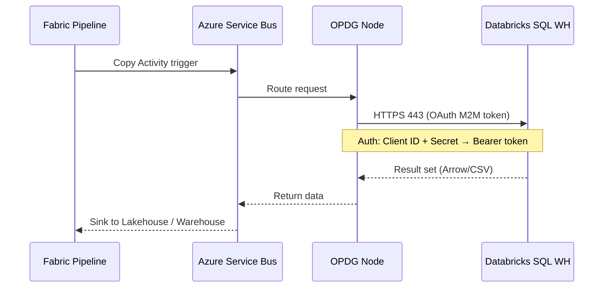

# AWS Data Source Connectivity — Network & Identity Reference

> **Version**: 1.0  
> **Date**: 2026-03-12  
> **Companion to**: [01-gateway-strategy.md](./01-gateway-strategy.md) | [02-gateway-architecture.md](./02-gateway-architecture.md)  
> **Scope**: All connectivity paths from Microsoft Fabric / Power BI to **AWS S3**, **AWS Databricks (Databricks on AWS)**, and **AWS Redshift** — covering network topology, identity / authentication models, and Fabric connector mapping.  

---

## 1. Connectivity Summary Matrix

| AWS Service | Fabric Feature | Connector / Method | Gateway Required? | Network Path | Identity Model |
|---|---|---|---|---|---|
| **S3** | OneLake Shortcut | Shortcut → S3 | No | Public HTTPS | IAM Access Key *or* IAM Role (cross-account) |
| **S3** | Fabric Pipeline (Copy Activity) | Amazon S3 connector | No (cloud) / OPDG (VPC endpoint) | Public HTTPS or S2S VPN | IAM Access Key (stored in Fabric connection) |
| **S3** | Dataflow Gen2 | Amazon S3 connector | No (cloud) / OPDG (VPC endpoint) | Public HTTPS or S2S VPN | IAM Access Key |
| **S3** | Notebook (Spark) | `boto3` / `s3a://` protocol | No | Public HTTPS | IAM Access Key or STS Assume-Role (env vars / Fabric secret) |
| **Redshift** | Semantic Model (Import) | Amazon Redshift connector | OPDG | S2S VPN or Public + TLS | Redshift DB credentials (user/password) |
| **Redshift** | Semantic Model (DirectQuery) | Amazon Redshift connector | OPDG | S2S VPN or Public + TLS | Redshift DB credentials |
| **Redshift** | Dataflow Gen2 | Amazon Redshift connector | OPDG | S2S VPN or Public + TLS | Redshift DB credentials |
| **Redshift** | Fabric Pipeline (Copy Activity) | Amazon Redshift connector | OPDG (private) / No (public) | S2S VPN or Public + TLS | Redshift DB credentials |
| **Redshift** | Notebook (Spark) | `redshift-connector` / JDBC | No | Public + TLS | Redshift DB credentials or IAM-based auth |
| **Redshift Serverless** | Same as above | Same connectors | Same rules | Public + TLS (RA3 public endpoint) or S2S VPN | IAM or DB credentials |
| **Databricks on AWS** | Semantic Model (Import/DQ) | Databricks connector | OPDG | Public HTTPS or S2S VPN | Databricks PAT or OAuth (M2M) |
| **Databricks on AWS** | Dataflow Gen2 | Databricks connector | OPDG | Public HTTPS or S2S VPN | Databricks PAT |
| **Databricks on AWS** | Fabric Pipeline (Copy Activity) | Databricks connector | OPDG (private) / No (public) | Public HTTPS or S2S VPN | Databricks PAT or OAuth (M2M) |
| **Databricks on AWS** | Notebook (Spark) | Databricks Connect v2 or REST API | No | Public HTTPS | Databricks PAT or OAuth (M2M) |
| **Databricks on AWS** | OneLake Shortcut | Shortcut → ADLS/S3 (Databricks-managed) | No | Public HTTPS | See S3 row above |

---

## 2. Network Architecture

### 2.1 Decision Tree — Choosing the Right Network Path

```
Is the AWS resource publicly accessible?
│
├── YES ──────────────────────────────────────────────┐
│   Is an OPDG required for this connector?           │
│   ├── YES → OPDG makes outbound HTTPS/TDS call     │
│   │         over the internet (TLS 1.2+)            │
│   │         ► Whitelist OPDG public IPs on AWS SG   │
│   └── NO  → Fabric cloud service connects directly  │
│             ► Whitelist Fabric service IPs or use    │
│               Fabric Trusted Service                 │
│                                                      │
└── NO (Private VPC only) ────────────────────────────┘
    OPDG is ALWAYS required.
    Choose connectivity method:
    ├── Option A: Site-to-Site VPN (Azure VPN GW ↔ AWS VGW)
    ├── Option B: ExpressRoute + Partner Peering ↔ AWS Direct Connect
    └── Option C: AWS PrivateLink (service-specific, limited use)
```

### 2.2 Network Topology — All Three Services



### 2.3 Network Option Details

#### Option A — Site-to-Site VPN (Recommended for most cases)

| Property | Value |
|---|---|
| **Azure side** | Azure VPN Gateway (VpnGw2 or higher), BGP enabled |
| **AWS side** | AWS Virtual Private Gateway (VGW) attached to target VPC |
| **Tunnels** | 2 × IPsec tunnels (active/active) for HA |
| **Encryption** | IKEv2, AES-256-GCM |
| **Bandwidth** | Up to 1.25 Gbps per tunnel (VpnGw2); aggregated with 2 tunnels |
| **Latency** | 10-30 ms same-geo (e.g., Azure North Europe ↔ AWS eu-west-1) |
| **Routing** | BGP dynamic routes; AWS VPC CIDR propagated to Azure route table |
| **Cost** | ~$0.05/hr Azure VPN GW + AWS VGW hourly + data transfer |

**Setup summary**:
1. Create Azure VPN Gateway in the Gateway VNet
2. Create AWS Virtual Private Gateway, attach to VPC
3. Create AWS Site-to-Site VPN connection → download configuration for Azure
4. Create Local Network Gateway in Azure with AWS VPC CIDR
5. Create Connection (IKEv2) between Azure VPN GW and Local Network GW
6. Verify BGP peering and route propagation
7. Update AWS Security Groups to allow OPDG subnet CIDRs

#### Option B — ExpressRoute + AWS Direct Connect (High-bandwidth / low-latency)

| Property | Value |
|---|---|
| **Azure side** | ExpressRoute Circuit (Standard or Premium SKU) |
| **AWS side** | AWS Direct Connect (Dedicated or Hosted) |
| **Bridge** | Colocation partner (Megaport, Equinix Fabric, or Console Connect) |
| **Bandwidth** | 50 Mbps – 100 Gbps depending on Direct Connect type |
| **Latency** | 3-10 ms same-geo |
| **Routing** | BGP between Azure MSEE ↔ Megaport VXC ↔ AWS DX Router |
| **Cost** | Higher than VPN — circuit fees + colocation port + data egress |

**When to use**: Large-volume Redshift extracts (> 50 GB/day), latency-sensitive DirectQuery workloads against Databricks SQL Warehouse, or when VPN throughput is insufficient.

#### Option C — Public Endpoint + TLS (Simplest)

| Property | Value |
|---|---|
| **Encryption** | TLS 1.2+ end-to-end |
| **Authentication** | IAM keys (S3), DB credentials (Redshift), PAT/OAuth (Databricks) |
| **IP restriction** | AWS Security Group or S3 bucket policy whitelisting OPDG NAT IPs / Fabric service IPs |
| **Bandwidth** | Internet throughput; no SLA |
| **Latency** | Variable (20-80 ms typical) |

**When to use**: S3 buckets that are already public/semi-public, Databricks workspaces with public networking, Redshift Serverless with public endpoints, or when VPN setup is not feasible.

---

## 3. Identity & Authentication — Deep Dive per Service

### 3.1 AWS S3



#### Authentication Options

| Method | How it works | Pros | Cons | Recommended for |
|---|---|---|---|---|
| **IAM Access Key** (Key ID + Secret) | Static long-lived credentials stored in Fabric connection | Simple setup; works with all Fabric connectors | Keys don't expire unless rotated; risk of leakage | OneLake Shortcut, Pipeline, Dataflow — when STS is not supported |
| **IAM Role (STS AssumeRole)** | Fabric or gateway calls `sts:AssumeRole` to get temporary creds | Short-lived tokens (1-12 hrs); no static secret stored | Requires trust policy on AWS side; not all Fabric connectors support it | Notebooks (via `boto3`); Pipeline if using custom activity |
| **S3 Bucket Policy (IP-based)** | Bucket policy restricts `s3:*` to specific source IPs + IAM principal | Defence-in-depth; limits blast radius | Must maintain IP list; doesn't replace authentication | Combined with IAM key — always add as secondary control |

#### IAM Policy — Minimum Permissions

```json
{
  "Version": "2012-10-17",
  "Statement": [
    {
      "Sid": "FabricS3ReadOnly",
      "Effect": "Allow",
      "Action": [
        "s3:GetObject",
        "s3:GetObjectVersion",
        "s3:ListBucket",
        "s3:GetBucketLocation"
      ],
      "Resource": [
        "arn:aws:s3:::my-fabric-bucket",
        "arn:aws:s3:::my-fabric-bucket/*"
      ]
    }
  ]
}
```

> Add `s3:PutObject` only if Fabric needs to write back (e.g., Pipeline sink). Follow least-privilege.

#### S3 Bucket Policy — IP Restriction

```json
{
  "Version": "2012-10-17",
  "Statement": [
    {
      "Sid": "AllowFabricAndGateway",
      "Effect": "Deny",
      "Principal": "*",
      "Action": "s3:*",
      "Resource": [
        "arn:aws:s3:::my-fabric-bucket",
        "arn:aws:s3:::my-fabric-bucket/*"
      ],
      "Condition": {
        "NotIpAddress": {
          "aws:SourceIp": [
            "20.50.0.0/16",
            "52.236.0.0/16"
          ]
        }
      }
    }
  ]
}
```

> Replace IP ranges with your actual OPDG NAT gateway IPs and/or [Fabric Service Tags](https://learn.microsoft.com/en-us/fabric/security/security-managed-vnets-fabric-service-tags).

#### Credential Rotation Policy

| Item | Policy |
|---|---|
| IAM Access Key rotation | Every 90 days (AWS Security Hub benchmark) |
| Store location | Fabric Connection credential store *or* Azure Key Vault referenced by Pipeline |
| Monitoring | Enable AWS CloudTrail `s3:GetObject` logging; alert on calls from unknown IPs |
| Break-glass | Deactivate key immediately in IAM Console; update Fabric connection |

---

### 3.2 AWS Redshift



#### Authentication Options

| Method | How it works | Pros | Cons | Recommended for |
|---|---|---|---|---|
| **Database user + password** | Traditional Redshift superuser or scoped user | Universal; works with all Fabric connectors | Static password; must rotate manually | Semantic Model, Dataflow Gen2, Pipeline — default method |
| **IAM-based temporary credentials** | Call `redshift:GetClusterCredentials` API to get a temp DB user/password (15 min – 1 hr) | No static password; auto-expires | Requires OPDG custom script or Pipeline Web Activity to fetch creds before query | Notebooks; Pipeline (advanced) |
| **Redshift Serverless + IAM** | Workgroup attached to IAM role; federated access | Fully IAM-native; no DB passwords | Only Redshift Serverless; limited connector support | Spark notebooks via JDBC with IAM plugin |
| **AWS Secrets Manager rotation** | Secrets Manager auto-rotates Redshift password on a schedule | Creds always fresh; no manual rotation | Fabric connection must be updated after each rotation (or use Pipeline secret lookup) | Environments with strict compliance |

#### Redshift Network — Firewall Rules

| Direction | Source | Destination | Port | Protocol |
|---|---|---|---|---|
| Outbound | OPDG subnet | Redshift cluster endpoint | 5439 | TCP (Postgres wire protocol) |
| Outbound | OPDG subnet | Redshift Serverless endpoint | 5439 | TCP |
| Inbound (AWS SG) | OPDG NAT IP / VPN CIDR | Redshift cluster SG | 5439 | TCP |

#### ODBC Driver Configuration (on OPDG VM)

| Setting | Value |
|---|---|
| Driver | `Amazon Redshift ODBC Driver (x64)` v2.x |
| Server | `my-cluster.xxxx.region.redshift.amazonaws.com` |
| Port | 5439 |
| Database | `analytics_db` |
| SSL Mode | `verify-full` (recommended) |
| SSL CA | Amazon root CA bundle (pre-installed with driver) |

> Install the latest **Amazon Redshift ODBC driver** on every OPDG node. Keep versions identical across the cluster.

#### Redshift User — Minimum Permissions

```sql
-- Create a read-only Fabric user
CREATE USER fabric_reader PASSWORD 'RotateMe!90days' NOCREATEDB NOCREATEUSER;

-- Grant access to target schema
GRANT USAGE ON SCHEMA analytics TO fabric_reader;
GRANT SELECT ON ALL TABLES IN SCHEMA analytics TO fabric_reader;
ALTER DEFAULT PRIVILEGES IN SCHEMA analytics GRANT SELECT ON TABLES TO fabric_reader;
```

---

### 3.3 Databricks on AWS



#### Authentication Options

| Method | How it works | Pros | Cons | Recommended for |
|---|---|---|---|---|
| **Personal Access Token (PAT)** | Long-lived token scoped to a Databricks user | Simple; supported by all Fabric connectors | User-scoped; no auto-expiry (must set manually); tied to individual | Semantic Model, Dataflow Gen2 — quick start |
| **OAuth Machine-to-Machine (M2M)** | Databricks service principal + OAuth client credentials flow | No human identity; auto-token refresh; audit-friendly | Requires Databricks account-level SP; setup more complex | Production Pipelines, Semantic Models — recommended for prod |
| **OAuth User-Delegated (U2DP)** | End-user signs in via Entra ID → SSO into Databricks | True SSO; respects user-level Unity Catalog ACLs | Requires Entra ID federation with Databricks; not all connectors support it | Interactive / DirectQuery when per-user RLS is needed |
| **Entra ID Federated Identity** | Databricks workspace linked to Entra ID via SCIM + SSO | Groups synced automatically; unified identity plane | Initial setup effort; requires Databricks Premium | Enterprise environments with centralised identity |

#### Databricks Network — Firewall Rules

| Direction | Source | Destination | Port | Protocol | Purpose |
|---|---|---|---|---|---|
| Outbound | OPDG subnet | `*.cloud.databricks.com` | 443 | HTTPS | Databricks REST API + SQL Warehouse |
| Outbound | OPDG subnet | Databricks Private Link (if enabled) | 443 | HTTPS (via S2S VPN) | Private connectivity to workspace |
| AWS SG Inbound | OPDG NAT IP / VPN CIDR | Databricks SG (data plane) | 443 | HTTPS | Allow OPDG traffic |

#### Connection String / ODBC (on OPDG VM)

| Setting | Value |
|---|---|
| Driver | `Simba Spark ODBC Driver` or `Databricks ODBC Driver` v2.x |
| Host | `dbc-xxxxxxx.cloud.databricks.com` |
| Port | 443 |
| HTTP Path | `/sql/1.0/warehouses/<warehouse_id>` |
| Auth | `AuthMech=11` (OAuth M2M) or `AuthMech=3` (PAT) |
| SSL | Enabled (always) |
| Thrift Transport | `HTTP` |

> Use a **Databricks SQL Warehouse** (Serverless preferred) as the compute for Fabric connectivity. Avoid connecting to all-purpose clusters for BI workloads — they are more expensive and less optimised for concurrent queries.

#### Databricks Service Principal — Setup Checklist

1. **Create a Databricks Service Principal** at the account level (Account Console → Service Principals)
2. **Generate OAuth secret** (Client ID + Client Secret) — store Client Secret in Azure Key Vault
3. **Assign workspace access** — add the SP to the target workspace
4. **Grant Unity Catalog privileges**:
   ```sql
   GRANT USE CATALOG ON CATALOG analytics_catalog TO `fabric-sp`;
   GRANT USE SCHEMA ON SCHEMA analytics_catalog.gold TO `fabric-sp`;
   GRANT SELECT ON SCHEMA analytics_catalog.gold TO `fabric-sp`;
   ```
5. **Create or use a SQL Warehouse** — ensure the SP has CAN USE permission
6. **Configure Fabric connection** with Client ID + Client Secret + Workspace URL

#### Identity Federation — Entra ID ↔ Databricks (Optional but recommended)

| Step | Detail |
|---|---|
| 1. Enable SCIM | Databricks workspace → Admin Settings → Identity Providers → Enable SCIM provisioning |
| 2. Configure Entra ID Enterprise App | Azure Portal → Enterprise Applications → Databricks → Provisioning → Automatic |
| 3. Map attributes | `userPrincipalName` → `userName`, `displayName` → `displayName`, Security Groups → Databricks Groups |
| 4. Enable SSO | SAML 2.0 between Entra ID and Databricks (ACS URL from Databricks admin) |
| 5. Verify | Users/groups from Entra ID appear in Databricks; SSO login works; Unity Catalog ACLs reference synced groups |

> With Entra ID federation, your Databricks access model mirrors your Azure access model. Security groups used for Fabric workspace RBAC can also govern Unity Catalog permissions — single pane of glass for identity governance.

---

## 4. End-to-End Flow by Fabric Feature

### 4.1 OneLake Shortcut → S3



**Key points**:
- No gateway involved — OneLake service calls S3 directly
- IAM Access Key is stored in the Fabric Shortcut connection
- Data is read at query time (no copy); caching controlled by OneLake
- S3 bucket must allow `s3:GetObject` + `s3:ListBucket` from Fabric IPs

### 4.2 Semantic Model (Import) → Redshift via OPDG



**Key points**:
- OPDG is mandatory — Redshift connector requires it
- Connection goes through S2S VPN (private) or public endpoint (TLS)
- ODBC driver installed on every OPDG node
- Credential stored in Fabric Connection (encrypted at rest)

### 4.3 Pipeline Copy Activity → Databricks SQL Warehouse via OPDG



---

## 5. Security Hardening Checklist

| # | Control | AWS S3 | Redshift | Databricks |
|---|---|---|---|---|
| 1 | **Encrypt in transit** | TLS 1.2+ (enforced via bucket policy `aws:SecureTransport`) | SSL Mode = `verify-full` | HTTPS always (443) |
| 2 | **Encrypt at rest** | SSE-S3 or SSE-KMS | AES-256 cluster encryption | Managed by Databricks (AWS KMS) |
| 3 | **Restrict source IPs** | Bucket Policy with `aws:SourceIp` condition | Security Group inbound rules | IP Access List on workspace |
| 4 | **Least-privilege IAM/DB** | `s3:GetObject`, `s3:ListBucket` only | `GRANT SELECT` on specific schemas | `GRANT SELECT` on Unity Catalog schemas |
| 5 | **Credential rotation** | IAM key rotation every 90 days | DB password rotation via Secrets Manager | OAuth secret rotation every 180 days |
| 6 | **Audit logging** | CloudTrail S3 data events | Redshift audit logging (STL_QUERY) | Databricks audit logs (Account Console) |
| 7 | **Private networking** | S3 VPC Endpoint (Gateway type) | Enable private VPC subnet | Databricks Private Link |
| 8 | **Block public access** | `s3:PublicAccessBlock` on account level | Disable public accessibility | Disable public network access |
| 9 | **Monitor anomalies** | GuardDuty S3 protection | Redshift Advisor alerts | Databricks SQL alert on unusual queries |
| 10 | **Secret storage** | Azure Key Vault → Fabric Connection | Azure Key Vault → Fabric Connection | Azure Key Vault → Fabric Connection |

---

## 6. Troubleshooting — Common Issues

| Symptom | Likely Cause | Resolution |
|---|---|---|
| Shortcut shows "Access Denied" | IAM key lacks `s3:ListBucket` or bucket policy denies Fabric IP | Add missing IAM action; add Fabric service IP to bucket policy `Condition` |
| Redshift timeout from OPDG | Port 5439 blocked by NSG or AWS SG | Open outbound 5439 on OPDG NSG; add inbound 5439 on Redshift SG for VPN CIDR |
| Redshift SSL handshake failure | ODBC driver set to `verify-full` but CA bundle not found | Re-install Amazon Redshift ODBC driver (includes CA bundle); verify `SSLCertPath` |
| Databricks "401 Unauthorized" | PAT expired or OAuth secret rotated without updating Fabric connection | Re-generate PAT/secret; update Fabric Connection credential |
| Databricks "403 Forbidden" | SP not granted `CAN USE` on SQL Warehouse or `SELECT` in Unity Catalog | Run `GRANT` statements (see § 3.3 checklist) |
| Pipeline S3 copy returns 0 rows | Bucket or prefix path is wrong; or IAM key has access to different bucket | Verify `bucket/prefix` in connection; check IAM policy `Resource` ARN |
| VPN tunnel down | IKE phase 1/2 mismatch or BGP hold timer expired | Check Azure VPN Diagnostics + AWS VPN tunnel status; restart tunnel |
| Slow Redshift queries through OPDG | VPN bandwidth saturated or Redshift WLM queue contention | Scale VPN GW to VpnGw3+; tune Redshift WLM; use `UNLOAD` to S3 + Shortcut pattern |

---

## 7. Architecture Decision Records

### ADR-01: Prefer S3 Shortcut over Pipeline Copy for read-only analytics

- **Context**: S3 data can be consumed via OneLake Shortcut (zero-copy) or Pipeline Copy (data duplication).
- **Decision**: Use Shortcut as default for read-only analytics; reserve Pipeline Copy for transformation / staging.
- **Rationale**: Shortcuts avoid data duplication, reduce storage cost, and keep data fresh. Pipeline Copy is needed only when data must be transformed, joined with other sources, or loaded into a specific Lakehouse schema.

### ADR-02: Use OAuth M2M over PAT for Databricks production

- **Context**: Databricks supports both PAT and OAuth M2M for machine connectivity.
- **Decision**: Use OAuth M2M (service principal + client credentials) for all production workloads.
- **Rationale**: PATs are user-scoped, don't auto-expire, and create audit ambiguity. OAuth M2M ties operations to a service principal, supports automatic token refresh, and aligns with enterprise identity governance.

### ADR-03: Use S2S VPN for Redshift private clusters; public endpoint for Serverless PoCs

- **Context**: Redshift can be deployed in a private VPC subnet or with a public endpoint.
- **Decision**: Production Redshift clusters use S2S VPN. Serverless or PoC deployments may use the public endpoint with IP restriction.
- **Rationale**: Private VPC + VPN eliminates internet exposure. Public endpoint is acceptable for Serverless PoCs where VPN setup cost is not justified, provided IP whitelisting and TLS `verify-full` are enforced.

---

## 8. Cost Considerations

| Component | Estimated Monthly Cost | Notes |
|---|---|---|
| Azure VPN Gateway (VpnGw2) | ~$340 | Active-active; covers S2S VPN to AWS |
| AWS VGW + VPN Connection | ~$36 + data transfer | $0.05/hr + $0.09/GB egress |
| AWS Direct Connect (1 Gbps) | ~$220 + port + partner fees | Use for high-volume Redshift extracts |
| S3 requests (GET/LIST) | $0.0004 / 1,000 GET | Shortcut reads incur S3 request charges |
| Redshift RA3 (2 nodes, ra3.xlplus) | ~$1,400 | On-demand; consider reserved for savings |
| Databricks SQL Warehouse (Small) | ~$300-600 | Serverless scales to 0 when idle |
| OPDG VM (D8s_v5 × 3 nodes) | ~$900 | Shared across all AWS + on-prem workloads |

> **Data egress is the hidden cost** — AWS charges $0.09/GB for data leaving the AWS region. Shortcuts that read large S3 datasets frequently will accumulate egress charges. Consider co-locating Fabric capacity in the region closest to the AWS region, and use delta/parquet columnar formats to minimise bytes read.

---

*End of document.*
