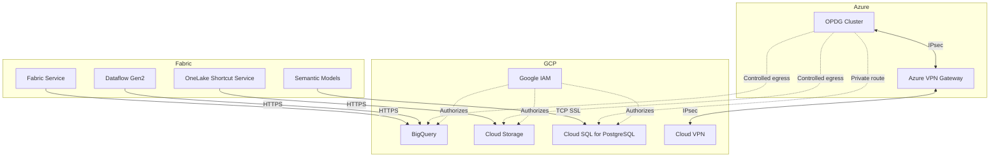
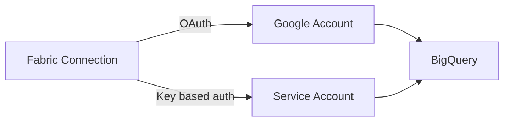
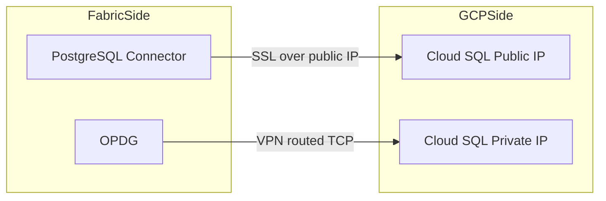
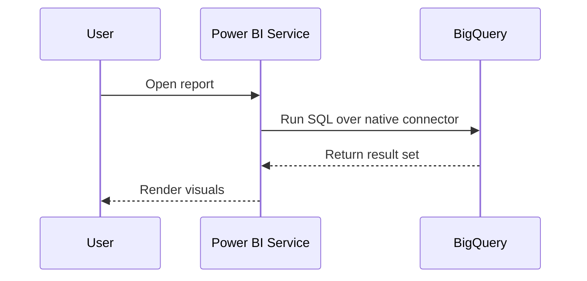
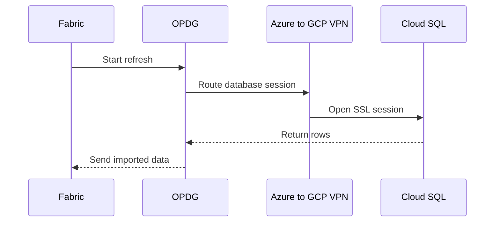
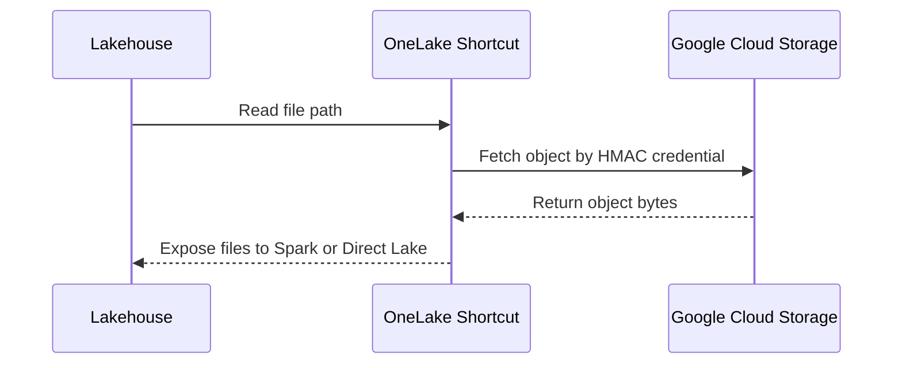

<p align="center">
  
  
  
</p>

<h1 align="center">GCP Data Source Connectivity</h1>

<p align="center">
  <strong>Connector-by-connector guidance for deciding when Microsoft Fabric and Power BI can connect directly to Google Cloud Platform and when a gateway, VPN, or staged lakehouse pattern is still required.</strong>
</p>

<p align="center">
  <a href="#1-connectivity-summary-matrix">Summary Matrix</a> •
  <a href="#2-network-architecture">Network</a> •
  <a href="#3-identity--authentication--deep-dive-per-service">Identity</a> •
  <a href="#4-end-to-end-flow-by-fabric-feature">Flows</a> •
  <a href="#5-security-hardening-checklist">Security</a>
</p>

> **Version**: 1.0  
> **Date**: 2026-03-16  
> **Companion to**: [01-gateway-strategy.md](./01-gateway-strategy.md) | [02-gateway-architecture.md](./02-gateway-architecture.md)  
> **Scope**: All connectivity paths from Microsoft Fabric / Power BI to **Google BigQuery**, **Google Cloud SQL**, and **Google Cloud Storage (GCS)**, covering connector behavior, network topology, and authentication options.  

---

## GCP Quick Answers

| Service | Public endpoint supported without gateway? | Is OPDG still an option? | Best starting point |
|---|---|---|---|
| BigQuery | Yes | Yes, but not normally required | Native Google BigQuery connector |
| Cloud SQL for PostgreSQL | Yes | Yes | PostgreSQL connector for public IP, OPDG for private IP |
| GCS | Yes | Yes for on-prem or network-restricted shortcut paths | OneLake GCS shortcut |

> [!TIP]
> For GCP, the clean split is simple: **BigQuery is usually direct**, **Cloud SQL depends on public versus private IP exposure**, and **GCS is best consumed through OneLake shortcuts rather than a traditional Power Query database connector**.

## Executive Summary

This document separates GCP connectivity into three patterns:

1. **Direct cloud connectors** for services that Microsoft already supports natively over public HTTPS.
2. **Gateway-mediated private access** when the GCP resource is reachable only through private networking such as Cloud VPN or Interconnect.
3. **Storage virtualization through OneLake shortcuts** when the Fabric-native access model is file-based rather than connector-based.

In practice:

- **BigQuery** is a native cloud-to-cloud connector and should start gateway-free.
- **Cloud SQL for PostgreSQL** can be direct when public IP access is enabled and tightly restricted; use **OPDG** when the instance is private-only.
- **GCS** is best integrated through a **OneLake shortcut** with HMAC-based credentials; use OPDG only when the storage path is network-restricted or explicitly routed through gateway-managed access.

The remaining sections turn those rules into concrete implementation guidance for architecture, identity, security, and operating decisions.

## 1. Connectivity Summary Matrix

| GCP Service | Fabric Feature | Connector / Method | Gateway Required? | Network Path | Identity Model |
|---|---|---|---|---|---|
| **BigQuery** | Semantic Model (Import) | Google BigQuery connector | No | Public HTTPS | Organizational account or Service account |
| **BigQuery** | Semantic Model (DirectQuery) | Google BigQuery connector | No | Public HTTPS | Organizational account or Service account |
| **BigQuery** | Dataflow Gen2 | Google BigQuery connector | No | Public HTTPS | Organizational account or Service account |
| **BigQuery** | Notebook (Spark / Python) | BigQuery client library or REST | No | Public HTTPS | Service account |
| **BigQuery** | Legacy gateway-managed path | Google BigQuery connector via OPDG | Optional | OPDG outbound HTTPS | Organizational account or Service account |
| **Cloud SQL for PostgreSQL** | Semantic Model (Import) | PostgreSQL connector | No for public IP; Yes for private IP | Public HTTPS / TCP with SSL or VPN-routed private path | Database credentials or Microsoft account |
| **Cloud SQL for PostgreSQL** | Semantic Model (DirectQuery) | PostgreSQL connector | No for public IP; Yes for private IP | Public HTTPS / TCP with SSL or VPN-routed private path | Database credentials or Microsoft account |
| **Cloud SQL for PostgreSQL** | Dataflow Gen2 | PostgreSQL connector | No for public IP; Yes for private IP | Public TCP with SSL or VPN-routed private path | Database credentials |
| **Cloud SQL for PostgreSQL** | Notebook (Spark / Python) | `psycopg` / JDBC | No | Public or private routed TCP | Database credentials or IAM-auth bootstrap outside connector |
| **GCS** | OneLake Shortcut | Shortcut → Google Cloud Storage | No | Public HTTPS | HMAC key for user or service account |
| **GCS** | Lakehouse / Direct Lake consumption | OneLake shortcut-backed lakehouse | No | Public HTTPS | Connection bound to shortcut |
| **GCS** | Notebook (Spark / Python) | `gcsfs`, REST, or lakehouse shortcut path | No | Public HTTPS | HMAC key or service account pattern outside shortcut |
| **GCS** | On-prem or network-restricted storage path | GCS shortcut via OPDG | Optional | OPDG outbound HTTPS | HMAC key |

---

## 2. Network Architecture

### 2.1 Decision Tree

```text
Is the GCP resource exposed on a public endpoint?
|
+-- YES
|   +-- Native Fabric or Power BI connector exists
|   |   -> Use direct cloud connection
|   +-- Native connector does not exist but OneLake shortcut exists
|       -> Use shortcut and consume through lakehouse
|
+-- NO
    -> Use OPDG with private routing
    -> Typical path is Azure VPN Gateway to Cloud VPN
    -> Use Cloud Interconnect only when throughput or latency justifies it
```

### 2.2 Reference Topology



### 2.3 Network Options

| Option | When to use | Notes |
|---|---|---|
| **Public HTTPS** | BigQuery, GCS, or public-IP Cloud SQL with strict allowlisting | Lowest operational overhead |
| **Cloud VPN + Azure VPN Gateway** | Private-IP Cloud SQL or controlled gateway egress | Best default private pattern |
| **ExpressRoute + Cloud Interconnect** | High-throughput private hybrid traffic | Only justified for sustained volume and latency-sensitive workloads |

---

## 3. Identity & Authentication — Deep Dive per Service

### 3.1 Google BigQuery



#### Key points

- Power Query lists **Organizational account** and **Service account** as the supported authentication types.
- Power BI service supports **cloud-to-cloud connection** to BigQuery, so a gateway is not the default architecture.
- DirectQuery is supported for Power BI semantic models.
- When using a service account in Power Query Online, the service account email maps to username and the JSON key content maps to password.

#### Operational caveats

- Only a **single cloud connection** is supported for BigQuery.
- If you see `Access Denied` or billing-related query failures, add a **Billing Project ID** in connector settings or M code.
- The newer BigQuery implementation uses **ADBC** instead of ODBC and has its own permission and rollout considerations.

### 3.2 Google Cloud SQL for PostgreSQL



#### Key points

- The PostgreSQL connector supports **cloud connection**, **VNet data gateway**, and **on-premises data gateway**; for GCP the relevant models are direct cloud connection or OPDG.
- Supported authentication types are **Database** and **Microsoft account**.
- DirectQuery is supported for Power BI semantic models.
- Since June 2025, the on-premises data gateway includes the **Npgsql** provider, reducing gateway-side setup friction.

#### Recommendation

- Prefer **public IP with SSL and IP allowlisting** only when the Cloud SQL instance is intentionally internet-reachable and tightly constrained.
- Prefer **private IP + Cloud VPN + OPDG** when the service is internal-only or the organization does not allow direct public ingress.

### 3.3 Google Cloud Storage


#### Key points

- OneLake supports **Google Cloud Storage shortcuts** as a native external shortcut type.
- GCS shortcuts use the **XML API** and require an **HMAC access key and secret**.
- The shortcut can target either the **global endpoint** `https://storage.googleapis.com` or a **bucket-specific endpoint**.
- GCS shortcuts are **read-only**.

#### Minimum permissions

| Connection scope | Required permissions |
|---|---|
| Bucket-specific endpoint | `storage.objects.get`, `storage.objects.list` |
| Global endpoint | `storage.objects.get`, `storage.objects.list`, `storage.buckets.list` |

---

## 4. End-to-End Flow by Fabric Feature

### 4.1 Semantic Model — DirectQuery to BigQuery



### 4.2 Semantic Model — Import from Cloud SQL Private IP



### 4.3 Lakehouse Shortcut to GCS



---

## 5. Security Hardening Checklist

- Enforce **least-privilege IAM** for BigQuery service accounts and GCS HMAC identities.
- Use **service accounts** instead of personal accounts for production BigQuery refresh and shortcut bindings.
- Restrict Cloud SQL public IP access by **source IP allowlisting** and require **SSL**.
- Prefer **private IP + VPN** for Cloud SQL when the database is business-critical or regulated.
- Store connector credentials in **managed connections** only; avoid embedding secrets in notebook code.
- Enable **shortcut caching** intentionally for GCS when reducing egress cost is valuable.
- Rotate GCS HMAC keys on a defined schedule and monitor unused keys.

---

## 6. Troubleshooting

| Symptom | Likely cause | Action |
|---|---|---|
| BigQuery `Access Denied` | Missing billing project or insufficient roles | Add Billing Project ID and verify BigQuery roles |
| BigQuery refresh fails only through gateway | Old gateway version or connector implementation mismatch | Upgrade gateway and review BigQuery implementation mode |
| Cloud SQL connection times out | Private IP reachable only inside GCP network | Use OPDG with VPN or expose controlled public IP |
| GCS shortcut cannot browse buckets | Using global endpoint without `storage.buckets.list` | Add permission or switch to bucket-specific endpoint |
| GCS shortcut reads fail | Invalid HMAC key or missing object permissions | Rotate keys and validate `storage.objects.get/list` |

---

## 7. Architecture Decision Records

### ADR-01 — BigQuery is direct-by-default

**Decision**: Use the native Google BigQuery connector without a gateway unless policy requires gateway-controlled egress.  
**Why**: Power BI service supports cloud-to-cloud connectivity and DirectQuery.  
**Consequence**: Lower latency and less infrastructure than a forced gateway design.

### ADR-02 — Private Cloud SQL uses OPDG

**Decision**: Use OPDG plus private routing for Cloud SQL instances that expose private IP only.  
**Why**: The PostgreSQL connector supports gateway runtime, and private GCP network paths otherwise are not reachable from Fabric cloud services.  
**Consequence**: More infrastructure, but clear control over network exposure.

### ADR-03 — GCS should enter Fabric through OneLake shortcuts first

**Decision**: Prefer GCS shortcuts over ad hoc REST ingestion for lake-centric analytics scenarios.  
**Why**: Shortcuts are native, governed, and directly consumable by Spark, SQL, and Direct Lake patterns.  
**Consequence**: Read-only by design, which is acceptable for analytical landing-zone use cases.