<p align="center">
  
    
  
</p>

<h1 align="center">Azure Data Source Connectivity</h1>

<p align="center">
  <strong>Connector-by-connector guidance for deciding when Microsoft Fabric and Power BI can connect directly to Azure services, when a VNet Data Gateway is the right design, and when OPDG remains the fallback.</strong>
</p>

<p align="center">
  <a href="#1-connectivity-summary-matrix">Summary Matrix</a> •
  <a href="#2-network-architecture">Network</a> •
  <a href="#3-identity--authentication--deep-dive-per-service">Identity</a> •
  <a href="#4-end-to-end-flow-by-fabric-feature">Flows</a> •
  <a href="#5-security-hardening-checklist">Security</a>
</p>

> **Version**: 1.0  
> **Date**: 2026-03-16  
> **Companion to**: [01-gateway-strategy.md](./01-gateway-strategy.md) | [02-gateway-architecture.md](./02-gateway-architecture.md)  
> **Scope**: All connectivity paths from Microsoft Fabric / Power BI to **Azure SQL Database**, **Azure SQL Managed Instance**, **Azure Synapse Analytics SQL**, **Azure Database for PostgreSQL**, **Azure Data Lake Storage Gen2**, **Azure Blob Storage**, **Azure Databricks**, **Azure Data Explorer**, **Azure Cosmos DB**, and **Azure streaming sources through Fabric Real-Time Intelligence**.  

---

## Azure Quick Answers

| Service | Public endpoint supported without gateway? | Preferred private pattern | Is OPDG still an option? |
|---|---|---|---|
| Azure SQL Database | Yes | VNet Data Gateway | Yes, as fallback |
| Azure SQL Managed Instance | Sometimes; depends on endpoint design | VNet Data Gateway | Yes, as fallback |
| Azure Synapse Analytics SQL | Yes | VNet Data Gateway for private route | Yes |
| Azure Database for PostgreSQL | Yes | VNet Data Gateway | Yes, as fallback |
| ADLS Gen2 | Yes | Trusted workspace access or VNet-aware path | Yes, for specific storage firewall cases |
| Azure Blob Storage | Yes | VNet Data Gateway for same-region firewall scenarios | Yes |
| Azure Databricks | Yes | VNet Data Gateway or OPDG when workspace storage is private | Yes |
| Azure Data Explorer | Yes | VNet Data Gateway | Yes |
| Azure Cosmos DB | Yes, for connector and mirroring setup | Native Fabric mirroring or direct connector; private network bypass for mirroring | Limited fallback, but mirroring is preferred |
| Azure Event Hubs / IoT / Service Bus streaming | Not through classic Power Query connectors | Fabric Eventstream with Private Link when needed | No classic gateway by default |

> [!TIP]
> Azure is where **VNet Data Gateway** should do most of the private-network heavy lifting. Use **OPDG** only when the workload is not supported by VNet Data Gateway or when you intentionally standardize on gateway-hosted runtime.

## Executive Summary

Azure connectivity is different from AWS and GCP because Fabric already lives in Microsoft cloud infrastructure and many Azure services expose first-class connector and shortcut paths.

The practical rules are:

1. Use **direct cloud connectivity** for public Azure SQL, public PostgreSQL, and standard storage access.
2. Use **VNet Data Gateway** when the Azure service is exposed only through a **private endpoint** or when Power Query Online requires a private route.
3. Use **OPDG** only as a workload fallback, especially for patterns not covered by VNet Data Gateway or where the execution engine still depends on gateway runtime semantics.

This same VNet GW model can also be extended to **supported non-Azure connectors** when those sources are routed into Azure networking, but Azure remains the place where VNet GW is the strongest default.

That makes Azure the least infrastructure-heavy cloud in this repository, but it still has important exceptions around storage firewalls, service principal behavior through gateways, Azure Databricks private storage access, Azure SQL Managed Instance network design, and Azure streaming scenarios where the current Microsoft direction is **Fabric Real-Time Intelligence with Private Link**, not legacy Power BI streaming outputs.

## 1. Connectivity Summary Matrix

| Azure Service | Fabric Feature | Connector / Method | Gateway Required? | Network Path | Identity Model |
|---|---|---|---|---|---|
| **Azure SQL Database** | Semantic Model (Import) | Azure SQL database connector | No for public endpoint; VNet GW for private endpoint | Public HTTPS / TDS or delegated VNet route | Microsoft account, Basic, Service Principal |
| **Azure SQL Database** | Semantic Model (DirectQuery) | Azure SQL database connector | No for public endpoint; VNet GW for private endpoint | Public HTTPS / TDS or delegated VNet route | Microsoft account, Basic, Service Principal |
| **Azure SQL Database** | Dataflow Gen2 | Azure SQL database connector | No for public endpoint; VNet GW for private endpoint | Public HTTPS / TDS or delegated VNet route | Microsoft account or Basic |
| **Azure SQL Database** | Workload not supported by VNet GW | Azure SQL database via OPDG | Optional fallback | OPDG outbound TLS | Microsoft account or Basic |
| **Azure SQL Managed Instance** | Semantic Model (Import / DirectQuery) | SQL Server or Azure SQL-aligned pattern to MI endpoint | Public endpoint optional; VNet GW for VNet-local or private endpoint | Port 1433 for VNet-local/private endpoint, 3342 for public endpoint | Database, Windows, Organizational account, Service principal depending on connector path |
| **Azure SQL Managed Instance** | Dataflow Gen2 | SQL Server connector to MI endpoint | VNet GW by default for private route; OPDG fallback | Routed TCP to MI endpoint | Database, Windows, Organizational account |
| **Azure Synapse Analytics SQL** | Semantic Model (DirectQuery) | Azure Synapse / Azure SQL DW pattern via Power BI Desktop | No for public endpoint; VNet GW for private route | Public HTTPS / SQL endpoint or private routed path | Microsoft Entra ID, database credentials |
| **Azure Synapse Analytics SQL** | Semantic Model (Import) | Azure Synapse / Azure SQL DW pattern | No for public endpoint; VNet GW or OPDG for private route | Public or private routed SQL path | Microsoft Entra ID, database credentials |
| **Azure Database for PostgreSQL** | Semantic Model (Import) | PostgreSQL connector | No for public endpoint; VNet GW for private endpoint | Public TCP with SSL or delegated VNet route | Database credentials or Microsoft account |
| **Azure Database for PostgreSQL** | Semantic Model (DirectQuery) | PostgreSQL connector | No for public endpoint; VNet GW for private endpoint | Public TCP with SSL or delegated VNet route | Database credentials or Microsoft account |
| **Azure Database for PostgreSQL** | Dataflow Gen2 | PostgreSQL connector | No for public endpoint; VNet GW for private endpoint | Public TCP with SSL or delegated VNet route | Database credentials |
| **ADLS Gen2** | OneLake Shortcut | Shortcut → ADLS Gen2 | No | DFS endpoint over HTTPS | Organizational account, Service principal, Workspace identity, SAS, Account key |
| **ADLS Gen2** | Lakehouse / Direct Lake | Shortcut-backed lakehouse | No | DFS endpoint over HTTPS | Connection bound to shortcut |
| **Azure Blob Storage** | Semantic Model / Dataflow Import | Azure Blob Storage connector | No in standard case; VNet GW or OPDG for same-region firewall edge case | Blob endpoint over HTTPS | Anonymous, Account key, Organizational account, SAS, Service principal |
| **Azure Blob Storage** | OneLake Shortcut | Shortcut → Azure Blob Storage | No | Blob endpoint over HTTPS | Organizational account, Service principal, Workspace identity, SAS, Account key |
| **Azure Databricks** | Semantic Model (Import / DirectQuery) | Azure Databricks connector | No for public SQL warehouse; VNet GW or OPDG if private storage path must be reached | HTTPS to SQL warehouse plus storage path for CloudFetch | Azure AD, PAT, Username / Password |
| **Azure Databricks** | Dataflow Gen2 | Azure Databricks connector | No for public SQL warehouse; VNet GW or OPDG for private storage access | HTTPS plus gateway path when storage is firewalled | Azure AD, PAT, Username / Password |
| **Azure Data Explorer** | Semantic Model (Import / DirectQuery) | Azure Data Explorer connector | No for public cluster; VNet GW for private route | HTTPS to Kusto cluster | Organizational account |
| **Azure Data Explorer** | Dataflow Gen2 | Azure Data Explorer connector | No for public cluster; VNet GW for private route | HTTPS to Kusto cluster | Organizational account |
| **Azure Cosmos DB** | Semantic Model (Import / DirectQuery) | Azure Cosmos DB v2 connector | Not required for public endpoint, but not preferred for new projects | HTTPS to Cosmos endpoint | Feed key or Organizational account |
| **Azure Cosmos DB** | Fabric analytics landing zone | Fabric Mirroring for Azure Cosmos DB | No gateway; use network ACL bypass for private account | Fabric-managed near real-time replication into OneLake | Entra ID with RBAC or account keys |
| **Azure Event Hubs / IoT Hub / Service Bus** | Real-time ingestion | Fabric Eventstream source connector | No classic gateway; use Workspace Private Link for supported private inbound scenarios | Eventstream ingress path into Fabric | Source-specific secrets, connection strings, or Entra ID depending on connector |
| **Azure Stream Analytics** | Real-time Power BI output | Legacy Power BI streaming output | No gateway, but deprecated direction | REST push into Power BI streaming semantic model | Power BI authorization or managed identity |

### 1.1 Where VNet Data Gateway Fits in Azure

For Azure, VNet Data Gateway is the primary private-network option and should be assumed first for:

- **Azure SQL Database** private endpoints,
- **Azure SQL Managed Instance** VNet-local or private endpoint designs,
- **Azure Synapse SQL** when the SQL endpoint is not exposed publicly,
- **Azure Database for PostgreSQL** private endpoints,
- **Azure Data Lake Storage Gen2** private connectivity scenarios that fall inside the supported workload model, and
- **Azure Blob Storage** when firewall behavior or same-region Power Query constraints make direct access unsuitable,
- **Azure Databricks** when the SQL warehouse is usable but private workspace storage requires a governed path for CloudFetch, and
- **Azure Data Explorer** when the Kusto cluster is reachable only through private routing.

For **Azure Cosmos DB**, prefer **Fabric mirroring** before considering the legacy Power Query connector.

For **Azure streaming**, treat **Fabric Eventstream plus Real-Time hub and Private Link** as a separate pattern rather than as another OPDG or VNet GW workload.

OPDG remains a fallback, not the default.

---

## 2. Network Architecture

### 2.1 Decision Tree

```text
Is the Azure service private-endpoint only?
|
+-- YES
|   -> Use VNet Data Gateway by default
|   -> If workload is not supported on VNet GW, use OPDG fallback
|
+-- NO
    +-- Public connector or shortcut exists
    |   -> Use direct cloud connection
    +-- Storage firewall or same-region Power Query edge case applies
        -> Use VNet GW or OPDG
```

### 2.2 Reference Topology

```mermaid
graph TB
    subgraph Fabric
        FAB["Fabric Service"]
        PQO["Power Query Online"]
        SC["OneLake Shortcut Service"]
    end

    subgraph AzureConnectivity
        VNET["VNet Data Gateway"]
        OPDG["OPDG Fallback"]
    end

    subgraph AzureServices
        SQL["Azure SQL Database"]
        SQLMI["Azure SQL Managed Instance"]
        SYN["Azure Synapse SQL"]
        PG["Azure PostgreSQL"]
        ADLS["ADLS Gen2"]
        BLOB["Azure Blob Storage"]
        DBR["Azure Databricks"]
        ADX["Azure Data Explorer"]
        COSMOS["Azure Cosmos DB"]
        STREAM["Azure Streaming Sources"]
    end

    FAB -->|Direct cloud path| SQL
    FAB -->|Connector path| SQLMI
    FAB -->|Connector path| SYN
    FAB -->|Direct cloud path| PG
    FAB -->|Native connector| DBR
    FAB -->|Native connector| ADX
    SC -->|Shortcut path| ADLS
    SC -->|Shortcut path| BLOB
    PQO -->|Import path| BLOB
    FAB -->|Mirror or connector| COSMOS
    STREAM -->|Eventstream / RTI| FAB

    VNET -.->|Private endpoint access| SQL
    VNET -.->|Private endpoint access| SQLMI
    VNET -.->|Private SQL route| SYN
    VNET -.->|Private endpoint access| PG
    VNET -.->|Firewall workaround| BLOB
    VNET -.->|Private storage or cluster path| DBR
    VNET -.->|Private cluster path| ADX
    OPDG -.->|Fallback path| SQL
    OPDG -.->|Fallback path| SQLMI
    OPDG -.->|Fallback path| SYN
    OPDG -.->|Fallback path| PG
    OPDG -.->|Fallback path| BLOB
    OPDG -.->|Fallback path| DBR
    OPDG -.->|Fallback path| ADX
```

### 2.3 Network Notes

| Pattern | Use it for | Why |
|---|---|---|
| **Direct cloud path** | Public Azure SQL, Synapse SQL, public Azure PostgreSQL, standard storage access | Lowest complexity |
| **VNet Data Gateway** | Private endpoints and Azure-native private connectivity | Best-aligned Azure design |
| **Fabric-native replication** | Azure Cosmos DB analytical landing into OneLake | Best analytical pattern for near real-time HTAP-style reporting |
| **Real-Time Intelligence path** | Event-driven ingestion from Azure streams and CDC sources | Modern streaming pattern that avoids legacy Power BI streaming constraints |
| **OPDG fallback** | Unsupported VNet GW workloads or explicit gateway runtime standardization | Keeps a single escape hatch for edge cases |

---

## 3. Identity & Authentication — Deep Dive per Service

### 3.1 Azure SQL Database

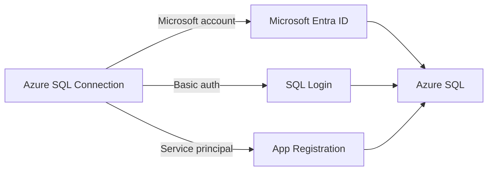

#### Key points

- The Azure SQL connector supports **Import** and **DirectQuery**.
- Supported authentication types include **Microsoft account**, **Basic**, and **Service Principal** in cloud-connected scenarios.
- **Service principal authentication is not supported through OPDG or VNet Data Gateway**.
- The connector supports advanced options such as **native SQL**, **command timeout**, and **failover support**.

#### Recommendation

- Use **direct cloud connection** whenever Azure SQL is publicly reachable and allowed by policy.
- Use **VNet Data Gateway** when the database sits behind a private endpoint.
- Use **OPDG** only when a specific workload or operational standard blocks VNet GW.

### 3.2 Azure Database for PostgreSQL

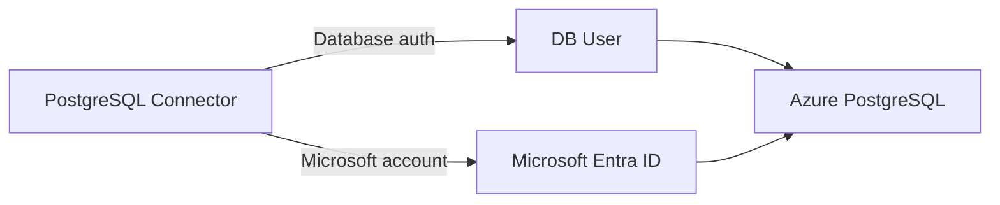

#### Key points

- Azure Database for PostgreSQL is consumed through the **PostgreSQL connector**.
- The connector supports **cloud connection**, **VNet Data Gateway**, and **OPDG**.
- Supported authentication types are **Database** and **Microsoft account**.
- DirectQuery is supported for Power BI semantic models.

#### Recommendation

- Public flexible server: direct connector with SSL.
- Private endpoint: VNet Data Gateway.
- Unsupported workload on VNet GW: OPDG fallback.

### 3.2b Azure SQL Managed Instance

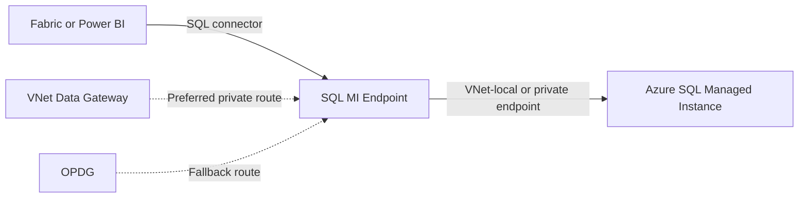

#### Key points

- Azure SQL Managed Instance is deployed inside a **customer virtual network** and supports **VNet-local**, **public**, and **private endpoint** access models.
- The **VNet-local endpoint** is the default connectivity model and listens on **1433**.
- The **public endpoint** is optional and listens on **3342**.
- For Fabric and Power BI, the practical consequence is that private MI designs usually require **VNet Data Gateway** or **OPDG**.

#### Recommendation

- Use the **public endpoint** only when policy allows and you explicitly want internet-reachable client connectivity.
- For enterprise MI deployments, assume **VNet Data Gateway** first.
- Keep **OPDG** as fallback where the workload or connector path still expects classic gateway semantics.

### 3.2c Azure Synapse Analytics SQL

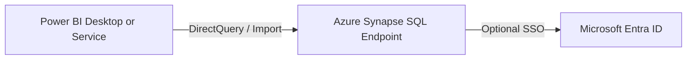

#### Key points

- Microsoft’s current guidance is to build the connection in **Power BI Desktop** and then publish; the old direct connector experience in the Power BI service is no longer the preferred route.
- Synapse SQL behaves as a **DirectQuery-friendly** analytical endpoint and supports **SSO with Microsoft Entra ID OAuth2** when configured correctly.
- Public endpoints can connect directly; private SQL exposure should follow the same **VNet GW first, OPDG fallback** pattern as other private Azure SQL services.

#### Recommendation

- Public dedicated SQL pool or SQL endpoint: direct connection.
- Private network-only Synapse SQL: **VNet Data Gateway**.
- Use **OPDG** only if the workload cannot use VNet GW or if you standardize on a shared gateway runtime.

### 3.3 ADLS Gen2

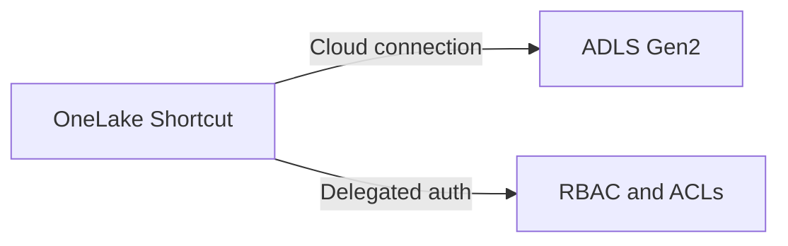

#### Key points

- OneLake supports **ADLS Gen2 shortcuts** natively.
- ADLS shortcut auth supports **Organizational account**, **Service principal**, **Workspace identity**, **SAS**, and **Account key**.
- The target must use the **DFS endpoint**.
- If a storage firewall protects the account, you can use **trusted workspace access**.

#### Important caveats

- Cross-tenant ADLS shortcuts do not support organizational account or workspace identity.
- ADLS shortcuts do not support storage accounts using **managed private endpoints**.
- For Microsoft Entra delegated auth, plan for **Generate a user delegation key** rights.

### 3.4 Azure Blob Storage

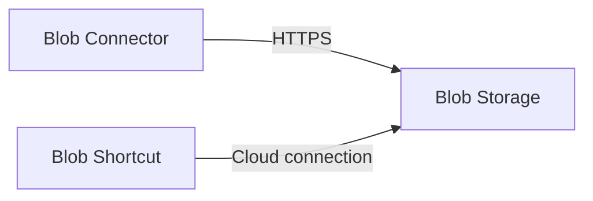

#### Key points

- Azure Blob Storage connector supports **Import** scenarios.
- Authentication supports **Anonymous**, **Account key**, **Organizational account**, **SAS**, and **Service principal**.
- **Service principal auth is not supported when using OPDG or VNet Data Gateway**.
- Blob shortcuts are available in **preview** and support **Organizational account**, **Service principal**, **Workspace identity**, **SAS**, and **Account key**.

#### Same-region firewall caveat

Power Query Online cannot directly access an Azure Storage account with firewall enabled when both are in the same region. In that case, use:

- **On-premises data gateway**, or
- **VNet Data Gateway**

### 3.5 Azure Databricks

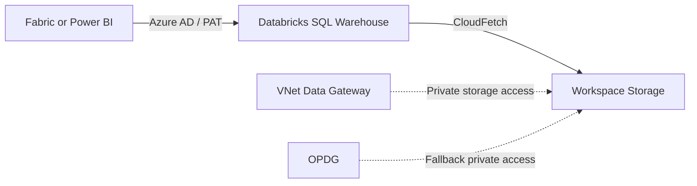

#### Key points

- The **Azure Databricks** connector supports **Import** and **DirectQuery**.
- Supported authentication includes **Azure Active Directory**, **Personal Access Token**, and **Username / Password** depending on host and product surface.
- Microsoft guidance is explicit that if the **workspace storage account firewall is enabled**, use **VNet Data Gateway** or **OPDG** so CloudFetch can still reach storage, or disable CloudFetch.
- The connector now supports **ADBC implementation 2.0** in preview.

#### Recommendation

- Public SQL warehouse with standard storage access: connect directly.
- Private storage account behind firewall: prefer **VNet Data Gateway**.
- If the workload or runtime model does not fit VNet GW, use **OPDG** fallback.

### 3.6 Azure Data Explorer

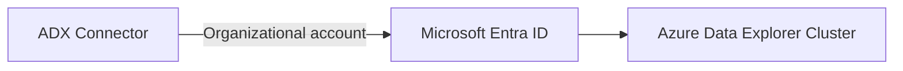

#### Key points

- The **Azure Data Explorer (Kusto)** connector supports **Import**, **DirectQuery**, and **Dataflow Gen2**.
- Authentication is **Organizational account**.
- Power Query Online supports the connector directly and can use a gateway when a private route is needed.
- For complex logic, Microsoft recommends using **Kusto functions** instead of embedding complex KQL in Power Query.

#### Recommendation

- Public cluster: direct connector.
- Private cluster: **VNet Data Gateway** first.
- Use **OPDG** only when the workload cannot use VNet GW.

### 3.7 Azure Cosmos DB

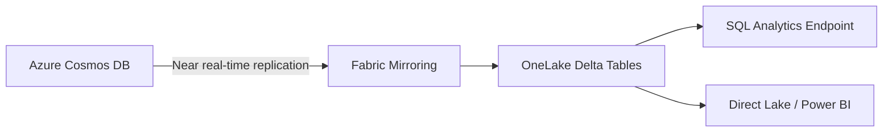

#### Key points

- The legacy **Azure Cosmos DB v2** connector supports **Import** and **DirectQuery**, with **Feed key** or **Organizational account** authentication.
- Microsoft now explicitly advises **not to use the v2 connector for new projects** and to prefer **Azure Cosmos DB Mirroring for Microsoft Fabric** instead.
- Mirroring provides **near real-time replication into OneLake** without consuming transactional **RUs** for replication and without a gateway.
- Mirroring supports **private networks** by using **Network ACL Bypass** for authorized Fabric workspaces.
- Continuous backup is required to enable mirroring.

#### Recommendation

- New analytical pattern: **Fabric Mirroring** first.
- Use the **v2 connector** only for existing/reporting scenarios that specifically need connector-based access.
- For AI or nested JSON workloads, mirroring is materially stronger than the legacy connector because it lands the data in OneLake and supports downstream SQL, Spark, and Direct Lake patterns.

### 3.8 Azure Streaming Sources and the New Streaming Pattern

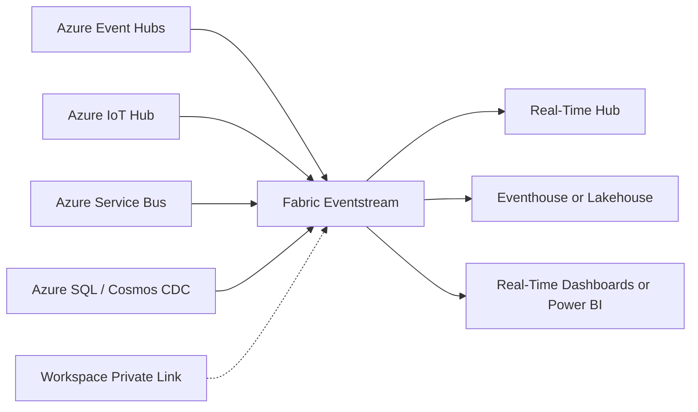

#### Key points

- The current Microsoft direction for streaming is **Fabric Real-Time Intelligence**, especially **Eventstream**, **Real-Time hub**, and downstream **Eventhouse**, **Lakehouse**, or **Activator** patterns.
- This is not a third classic gateway like **OPDG** or **VNet Data Gateway**. It is better documented as a **streaming ingestion architecture**.
- Eventstream supports Azure-native streaming inputs such as **Azure Event Hubs**, **Azure IoT Hub**, **Azure Service Bus**, **Azure Data Explorer**, **Azure SQL CDC**, **Azure Cosmos DB CDC**, and others.
- For private inbound streaming, Microsoft now supports **Tenant Private Link** and **Workspace Private Link** for selected Eventstream scenarios.
- Legacy **Power BI real-time streaming** and **Azure Stream Analytics output to Power BI** remain available for now, but Microsoft recommends migrating to **Fabric Real-Time Intelligence**, and creation of new Power BI streaming models is scheduled to stop after **2027-10-31**.

#### Recommendation

- New streaming design: use **Fabric Eventstream** and **Real-Time hub**.
- Need private inbound connectivity for supported sources: use **Workspace Private Link** rather than treating streaming as an OPDG use case.
- Keep legacy Power BI streaming only for existing solutions that you are not ready to migrate yet.

---

## 4. End-to-End Flow by Fabric Feature

### 4.1 DirectQuery to Azure SQL Public Endpoint

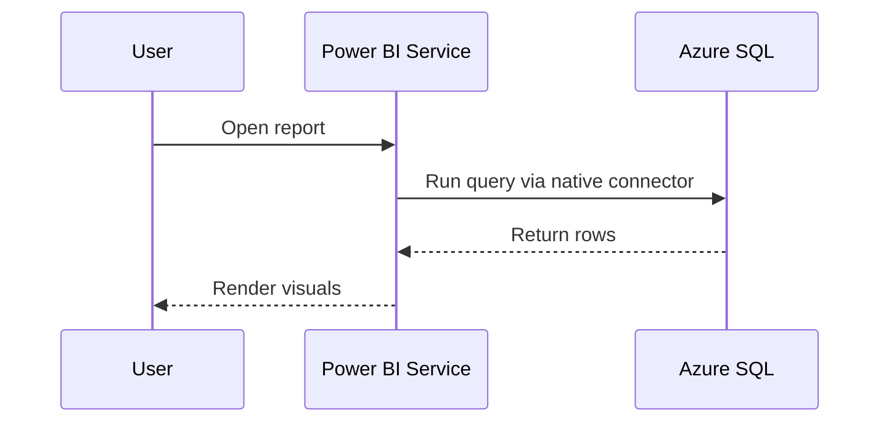

### 4.2 Import Refresh to Azure PostgreSQL Private Endpoint

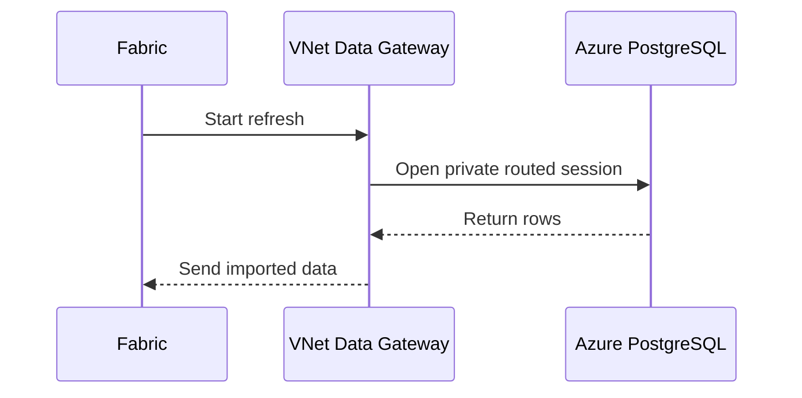

### 4.3 Lakehouse Shortcut to ADLS Gen2

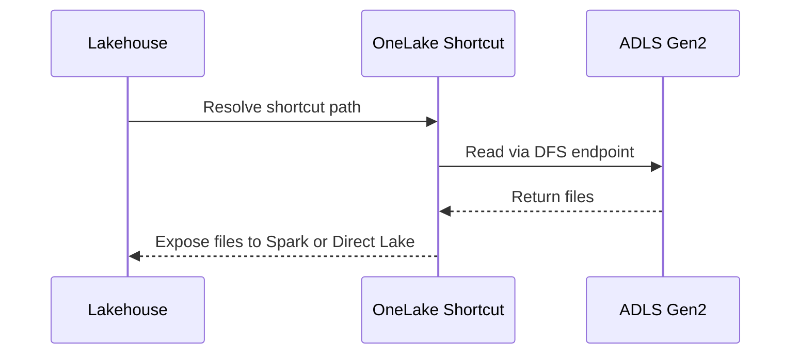

### 4.4 Near Real-Time Analytics from Azure Cosmos DB

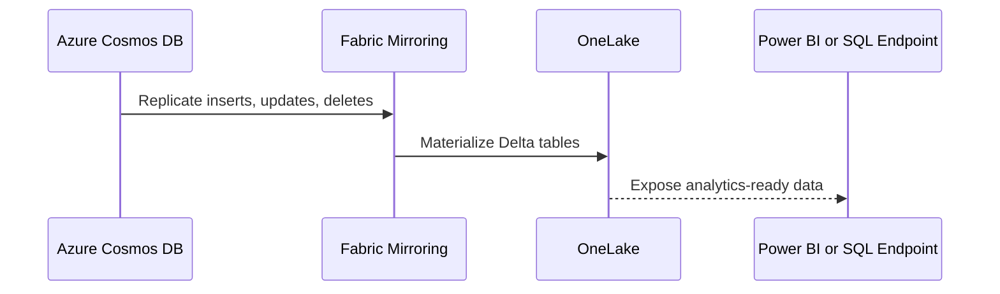

### 4.5 Real-Time Ingestion from Azure Event Hubs

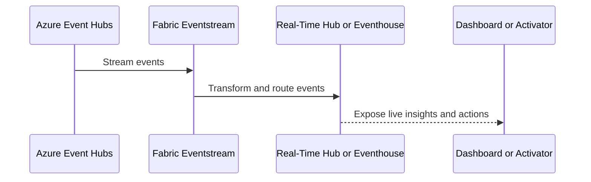

---

## 5. Security Hardening Checklist

- Prefer **VNet Data Gateway** over OPDG for Azure private endpoints.
- Use **Service Principal** only on direct cloud connections where the connector supports it end to end.
- Require **SSL or encrypted connections** for Azure SQL and PostgreSQL.
- For **Azure SQL Managed Instance**, validate endpoint type, DNS, and routed port requirements before choosing a connector path.
- Prefer **RBAC plus ACLs** over account keys for ADLS Gen2 where possible.
- Use **SAS** only with narrow scope and short lifetime.
- Avoid broad storage account keys for production shortcuts unless no delegated auth model is viable.
- Enable **trusted workspace access** for ADLS instead of broad firewall exceptions when supported.
- For **Azure Databricks**, validate both the SQL warehouse path and the backing storage access path.
- For **Azure Cosmos DB**, prefer **Entra ID plus RBAC** for mirroring and enable only the minimum required network bypass settings.
- For **Azure streaming**, prefer **Private Link-enabled Eventstream** over legacy Power BI streaming endpoints where private access matters.

---

## 6. Troubleshooting

| Symptom | Likely cause | Action |
|---|---|---|
| Azure SQL service principal works direct but not through gateway | Unsupported auth through OPDG or VNet GW | Switch to Microsoft account or Basic for gateway path |
| Azure SQL Managed Instance is reachable from SSMS but not from Fabric | MI uses VNet-local or private endpoint with no delegated Fabric route | Use VNet GW or OPDG and validate DNS plus port selection |
| Synapse report works in Desktop but not through the old service pattern | Service-side direct connector path is no longer the preferred model | Build and publish from Desktop, then configure the published semantic model |
| Azure PostgreSQL private server not reachable | No delegated VNet or no OPDG fallback | Use VNet GW or route OPDG appropriately |
| Blob connector fails in same region with firewall enabled | Known Power Query Online storage limitation | Use VNet GW or OPDG |
| ADLS shortcut auth fails with Entra-based identity | Missing RBAC, ACLs, or delegation key rights | Validate RBAC, ACLs, and delegated key permissions |
| Cross-tenant ADLS shortcut fails with organizational account | Unsupported cross-tenant auth mode | Use service principal or SAS |
| Azure Databricks query succeeds but large results fail | CloudFetch cannot reach private workspace storage | Use VNet GW or OPDG, or disable CloudFetch |
| Azure Data Explorer DirectQuery query is brittle | Complex KQL embedded in Power Query | Move logic into Kusto functions |
| Azure Cosmos DB analytics design is slow or schema-fragile | Legacy v2 connector used for evolving or nested JSON workloads | Prefer Fabric mirroring |
| Streaming architecture still targets Power BI streaming semantic models | Legacy pattern approaching retirement | Migrate to Eventstream and Real-Time Intelligence |

---

## 7. Architecture Decision Records

### ADR-01 — Azure private endpoints prefer VNet Data Gateway

**Decision**: Use VNet Data Gateway as the default private-connectivity model for Azure PaaS sources.  
**Why**: It aligns with Azure-native networking and avoids VM-based gateway management.  
**Consequence**: OPDG becomes an exception path, not the default.

### ADR-02 — OPDG remains the Azure fallback, not the first choice

**Decision**: Retain OPDG only for workloads unsupported by VNet Data Gateway or where gateway runtime behavior is required.  
**Why**: It preserves compatibility without forcing VM-hosted gateways onto Azure-native scenarios.  
**Consequence**: Lower operational overhead for most Azure data sources.

### ADR-03 — OneLake shortcuts are the preferred storage entry point

**Decision**: Prefer ADLS Gen2 and Blob shortcuts for lake-centric consumption patterns.  
**Why**: Shortcuts integrate directly with Spark, SQL, and Direct Lake patterns while centralizing storage authorization through managed connections.  
**Consequence**: Storage access becomes more standardized and less dependent on duplicated ingestion logic.

### ADR-04 — Azure Cosmos DB analytics should prefer mirroring over the legacy connector

**Decision**: Use Fabric Mirroring as the default analytics pattern for Azure Cosmos DB.  
**Why**: Microsoft no longer recommends the v2 connector for new projects, and mirroring gives near real-time OneLake replication without gateway infrastructure.  
**Consequence**: Azure Cosmos DB joins the Azure-native path set where the best design is gateway-free by default.

### ADR-05 — Azure streaming should use Fabric Real-Time Intelligence, not legacy Power BI streaming

**Decision**: Treat Azure streaming as a Real-Time Intelligence architecture pattern built on Eventstream, Real-Time hub, Eventhouse, and Private Link where supported.  
**Why**: Microsoft is deprecating new Power BI real-time streaming model creation and recommends Fabric Real-Time Intelligence as the target architecture.  
**Consequence**: Streaming is documented separately from OPDG and VNet GW instead of being forced into the classic gateway model.