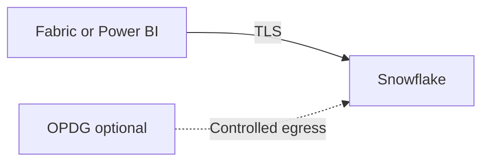
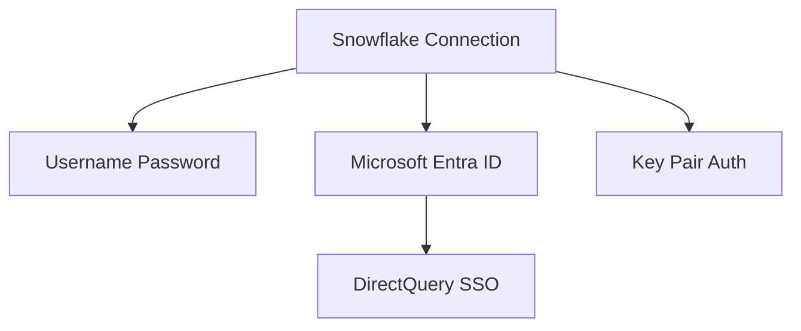
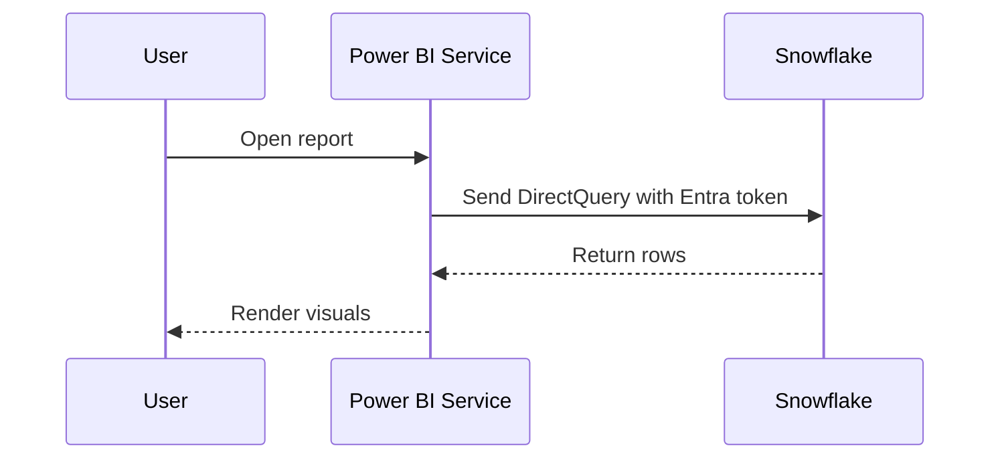
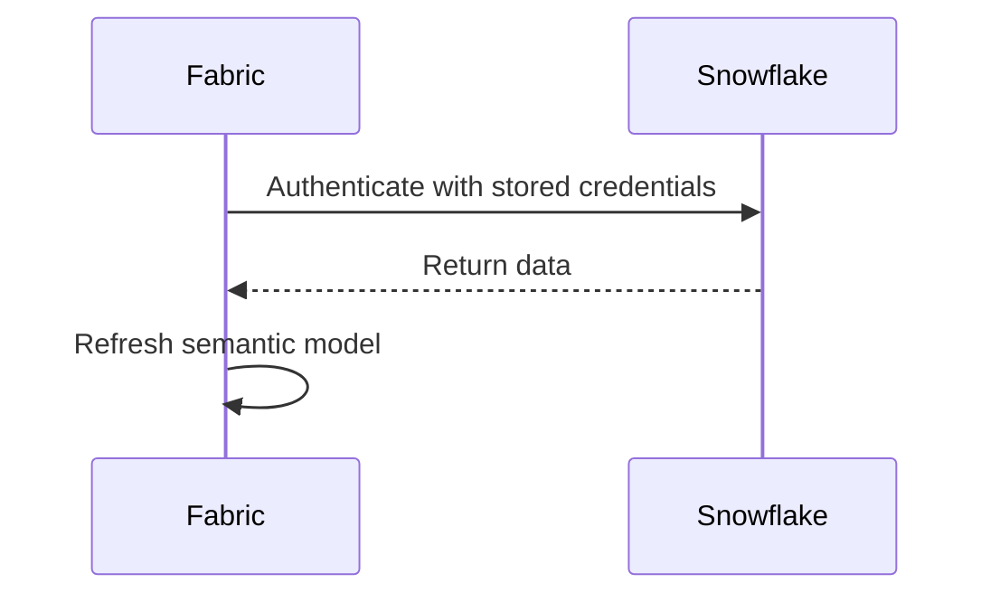

  
  
  

<h1 align="center">Snowflake Connectivity</h1>

  <strong>Implementation guidance for connecting Microsoft Fabric and Power BI to Snowflake, with emphasis on native cloud connectivity, Entra ID, SSO, and when OPDG is still relevant.</strong>

  <a href="#1-connectivity-summary">Summary</a> •
  <a href="#2-network-model">Network</a> •
  <a href="#3-identity--authentication">Identity</a> •
  <a href="#4-flow-patterns">Flows</a> •
  <a href="#5-operational-caveats">Caveats</a>

> **Version**: 1.0  
> **Date**: 2026-03-16  
> **Companion to**: [06-cross-cloud-comparison.md](./06-cross-cloud-comparison.md)

---

## Executive Summary

Snowflake should be treated as a **direct cloud connector first** source.

- Native connector support exists across Power BI semantic models, Power BI dataflows, and Fabric Dataflow Gen2.
- DirectQuery is supported.
- Authentication supports **Username/Password**, **Microsoft Entra ID**, and **Key Pair Auth**.
- OPDG is optional, not mandatory. It remains relevant only when the organization forces gateway-controlled routing or when using gateway-based SSO scenarios.

## 1. Connectivity Summary

| Fabric feature | Connector / method | Gateway required? | Best auth model |
|---|---|---|---|
| Semantic Model (Import) | Snowflake connector | No | Key Pair Auth or Username/Password |
| Semantic Model (DirectQuery) | Snowflake connector | No | Microsoft Entra ID when SSO is desired |
| Dataflow Gen2 | Snowflake connector | No | Key Pair Auth or Username/Password |
| Power BI service with SSO | Snowflake connector with Entra ID | No by default; OPDG optional in gateway-based SSO pattern | Microsoft Entra ID |
| Gateway-controlled enterprise route | Snowflake via OPDG | Optional | Username/Password or Entra ID depending model |

## 2. Network Model

### Guidance

- Prefer direct outbound TLS to Snowflake.
- Use OPDG only when the enterprise insists on a fixed gateway egress path or a gateway-managed SSO pattern.
- Keep firewall and network controls focused on **allowlisting**, **private connectivity design**, and **identity hardening**, not on adding a gateway by default.

## 3. Identity & Authentication

### Supported auth

| Method | Notes |
|---|---|
| Username/Password | Supported today, but Snowflake is moving away from single-factor password patterns |
| Microsoft Entra ID | Best fit for DirectQuery and SSO-driven user identity |
| Key Pair Auth | Strong machine identity option; not supported for Dataflows Gen1 |

### SSO notes

- Microsoft Entra ID SSO is supported for **DirectQuery**.
- Tenant-level Power BI admin configuration is required to enable Snowflake SSO in the Power BI service.
- Semantic model creators must enable end-user OAuth2 credentials in semantic model settings to turn on SSO.

## 4. Flow Patterns

### 4.1 DirectQuery with Entra ID SSO

### 4.2 Import refresh with service credentials

## 5. Operational Caveats

| Topic | Guidance |
|---|---|
| Connector implementation 2.0 | Generally available and preferred; uses ADBC |
| Gateway version | If OPDG is used, keep it current; minimum supported vintage for 2.0 is January 2025 |
| DirectQuery SSO | Only Entra ID-based DirectQuery SSO is supported |
| Known 2.0 issues | Watch `count distinct` behavior and memory consumption on large workloads |

## 6. Architecture Decision Record

### ADR-01 — Snowflake is direct-by-default

**Decision**: Use the native Snowflake connector without OPDG unless a gateway-controlled enterprise route is explicitly required.  
**Why**: Snowflake is a mature cloud connector with DirectQuery and Entra ID support.  
**Consequence**: Lower operational overhead and simpler latency path.