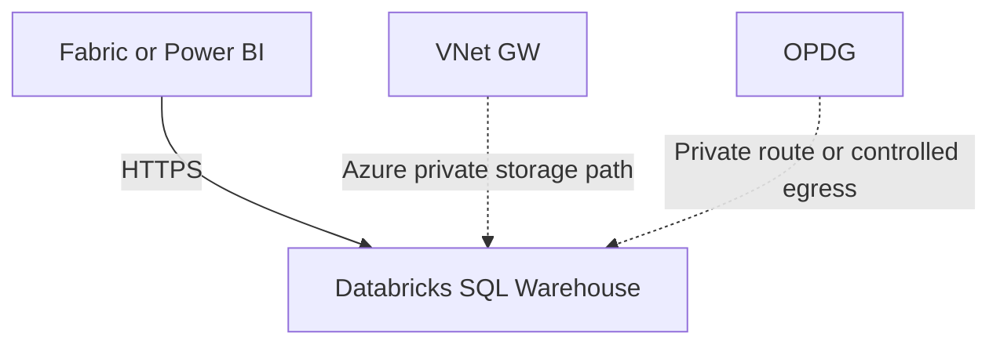
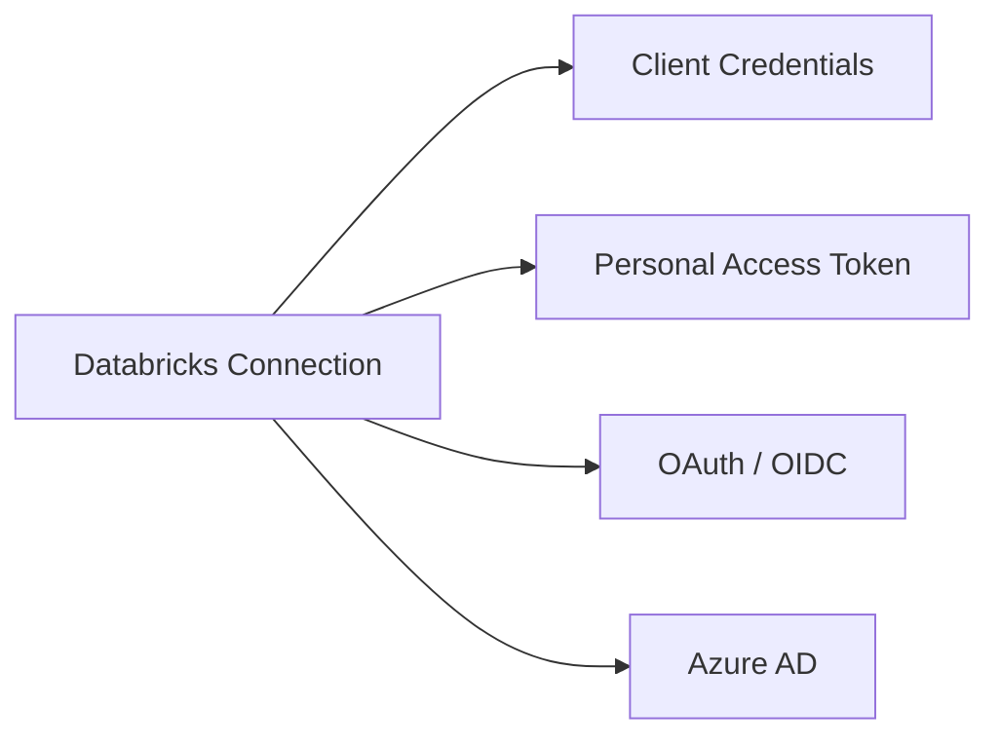
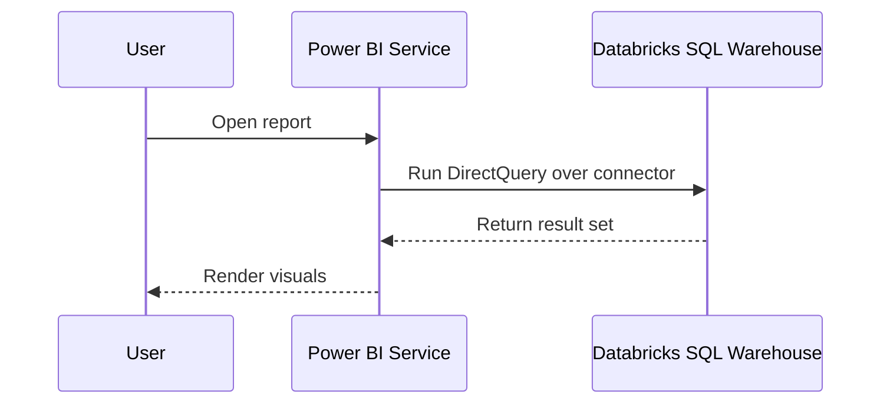
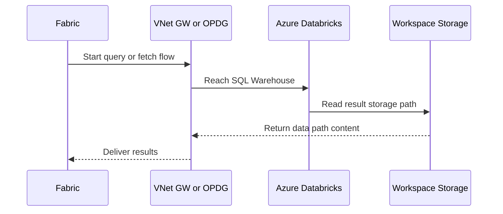

  
  
  

<h1 align="center">Databricks Connectivity</h1>

  <strong>Implementation guidance for Databricks SQL Warehouse connectivity from Microsoft Fabric and Power BI across AWS, Azure, and GCP, including connector choice, authentication, and private-network exceptions.</strong>

  <a href="#1-connector-selection">Connector Selection</a> •
  <a href="#2-connectivity-summary">Summary</a> •
  <a href="#3-network-and-platform-specific-notes">Network</a> •
  <a href="#4-identity--authentication">Identity</a> •
  <a href="#5-flow-patterns">Flows</a>

> **Version**: 1.0  
> **Date**: 2026-03-16  
> **Companion to**: [03-aws-connectivity.md](./03-aws-connectivity.md) | [06-cross-cloud-comparison.md](./06-cross-cloud-comparison.md)

---

## Executive Summary

Databricks is now best documented as a **multi-cloud SaaS analytics platform** with two practical connector paths:

1. The **Databricks** connector, primarily positioned for Databricks SQL Warehouse with OAuth on AWS.
2. The **Azure Databricks** connector, which current Microsoft documentation positions as the general connector to use for Databricks SQL Warehouse unless Databricks instructs otherwise.

For this repository, the operational answer is:

- **Public SQL Warehouse**: direct connector first, no gateway by default.
- **Private workspace / private storage dependency**: gateway becomes relevant.
- **Azure Databricks workspace storage behind firewall**: VNet Data Gateway or OPDG may be required for CloudFetch and storage access.

## 1. Connector Selection

| Scenario | Recommended connector | Notes |
|---|---|---|
| Databricks SQL Warehouse on AWS using OAuth | `Databricks` connector | Supported path in connector-specific doc |
| Databricks SQL Warehouse on Azure | `Azure Databricks` connector | Supports Azure AD, PAT, and client credentials |
| Databricks SQL Warehouse on AWS, Azure, or GCP for broad coverage | `Azure Databricks` connector | Microsoft docs now position this as the general connector unless instructed otherwise |
| Legacy or special Databricks guidance from vendor | Follow Databricks instruction | Connector ownership is Databricks-side |

## 2. Connectivity Summary

| Fabric feature | Connector / method | Gateway required? | Best auth model |
|---|---|---|---|
| Semantic Model (Import) | Databricks or Azure Databricks connector | No for public SQL Warehouse | OAuth or client credentials |
| Semantic Model (DirectQuery) | Databricks or Azure Databricks connector | No for public SQL Warehouse | OAuth, PAT, or Azure AD depending platform |
| Dataflow Gen2 | Databricks or Azure Databricks connector | No for public SQL Warehouse | PAT or OAuth |
| Private workspace pattern | Same connectors via gateway-routed path | Yes | PAT or client credentials |
| Azure workspace storage firewall scenario | Azure Databricks plus VNet GW or OPDG | Yes | Azure AD, PAT, or client credentials |

## 3. Network and Platform-Specific Notes

### AWS / GCP Databricks

- Public SQL Warehouse is typically direct.
- Private networking or enterprise-controlled egress can justify OPDG.
- PAT, OAuth, and client credentials are the practical auth patterns.

### Azure Databricks

- Public SQL Warehouse is typically direct.
- If workspace storage firewall support is enabled, **VNet Data Gateway or OPDG** might be required so CloudFetch and workspace storage access continue to function.
- The Azure Databricks connector documents specific allowlisting requirements for storage endpoints and certificate endpoints.

## 4. Identity & Authentication

| Method | Platform fit | Notes |
|---|---|---|
| Client credentials | AWS, Azure, GCP | Strong machine-to-machine option |
| PAT | AWS, Azure, GCP | Operationally common but weaker than workload identity |
| OAuth / OIDC | AWS-focused generic connector, also broadly useful | Best fit for browser or org-account auth |
| Azure AD | Azure only | Useable only for Azure Databricks |

## 5. Flow Patterns

### 5.1 Public SQL Warehouse DirectQuery

### 5.2 Azure private storage dependency

## 6. Operational Caveats

| Topic | Guidance |
|---|---|
| Native query in Power BI service | Not supported on the Databricks connector |
| ADBC support | Available in preview for Databricks connectors via `Implementation="2.0"` |
| Proxy support | Azure Databricks supports web proxy, but not automatic PAC-based proxy settings |
| DirectQuery limitation | `Databricks.Query` is not supported with Power BI semantic model DirectQuery |

## 7. Architecture Decision Record

### ADR-01 — Databricks is public-direct by default

**Decision**: Use Databricks connectors directly for public SQL Warehouse endpoints.  
**Why**: Connector support exists for semantic models, dataflows, and Fabric Dataflow Gen2.  
**Consequence**: Gateways are reserved for private networking and storage-firewall edge cases.