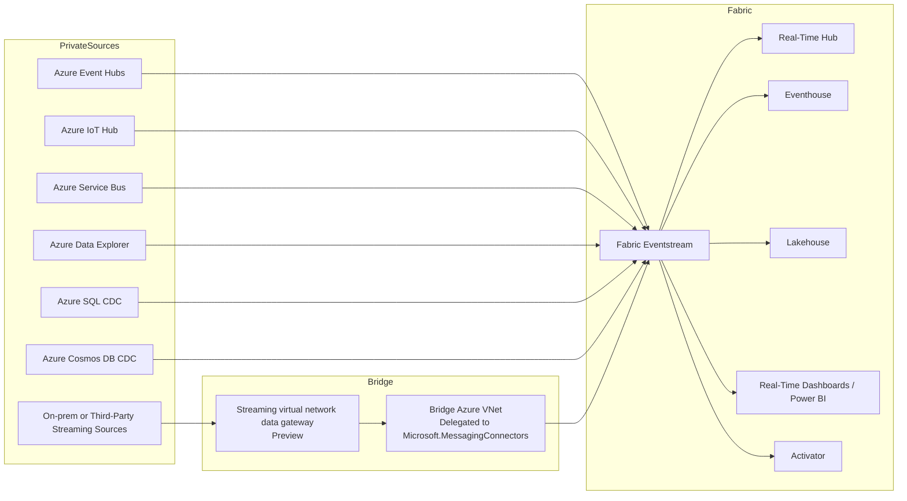
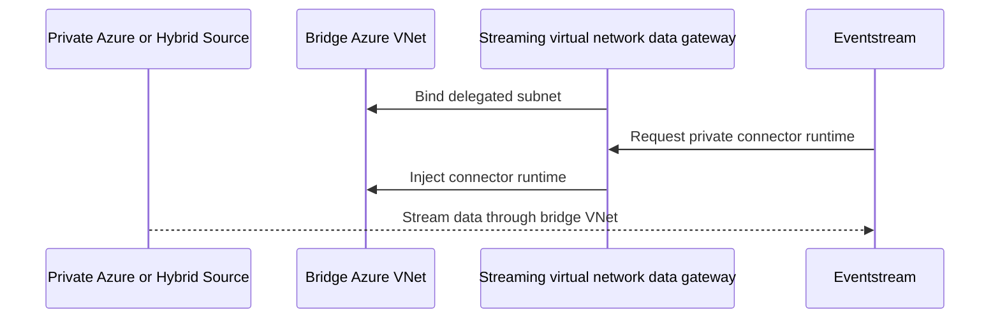

  
  
  

<h1 align="center">Azure Streaming Connectivity</h1>

  <strong>Reference guidance for connecting private and public Azure streaming sources to Microsoft Fabric Real-Time Intelligence, with a clear separation between classic gateways and the new Eventstream-specific streaming gateway model.</strong>

  <a href="#1-quick-answers">Quick Answers</a> •
  <a href="#2-reference-architecture">Architecture</a> •
  <a href="#3-connectivity-matrix">Matrix</a> •
  <a href="#4-private-network-patterns">Private Network Patterns</a> •
  <a href="#5-migration-from-legacy-power-bi-streaming">Migration</a>

> **Version**: 1.0  
> **Date**: 2026-03-16  
> **Companion to**: [01-gateway-strategy.md](./01-gateway-strategy.md) | [02-gateway-architecture.md](./02-gateway-architecture.md) | [05-azure-connectivity.md](./05-azure-connectivity.md)  
> **Scope**: Streaming ingestion from **Azure Event Hubs**, **Azure IoT Hub**, **Azure Service Bus**, **Azure Data Explorer**, **Azure SQL CDC**, **Azure Cosmos DB CDC**, and related event-driven Azure sources into **Fabric Eventstream**, **Real-Time hub**, **Eventhouse**, **Lakehouse**, **Real-Time dashboards**, and **Activator**.  

---

## 1. Quick Answers

| Question | Short answer |
|---|---|
| Is streaming handled through OPDG? | No, not as the default architecture. |
| Is streaming handled through classic VNet Data Gateway? | No, not for Eventstream connector reachability. |
| What is the new private streaming option? | **Streaming virtual network data gateway** in preview for Eventstream connectors. |
| What is the target platform for new Azure streaming designs? | **Fabric Real-Time Intelligence** with **Eventstream** and **Real-Time hub**. |
| Should I still design around Power BI streaming semantic models? | Only for existing workloads. Microsoft recommends moving to Fabric RTI. |

> [!TIP]
> Treat Azure streaming as a separate architecture domain from classic query and refresh connectivity. The gateway choice for Eventstream connectors is now its own pattern.

## Executive Summary

Azure streaming now has a clearer Microsoft-recommended target architecture than it did previously.

For new designs, use **Fabric Real-Time Intelligence**. In practical terms that means:

1. Use **Eventstream** to ingest, transform, and route streaming data.
2. Use **Real-Time hub** as the tenant-wide discovery and management layer for streaming assets.
3. Use **Eventhouse**, **Lakehouse**, **Real-Time dashboards**, or **Activator** as the downstream analytics and action destinations.
4. When sources are private, use the preview **Streaming virtual network data gateway** so Eventstream connectors can run inside a bridge Azure virtual network and reach those private sources.
5. Use **Workspace Private Link** or **Tenant Private Link** where the scenario is about securing inbound Eventstream access rather than giving connectors network reach into a private source.

This is not the same as **On-premises Data Gateway** or the standard **VNet Data Gateway** used for Power Query and semantic model refresh scenarios. Those remain important for classic connectivity, but the streaming runtime now has its own dedicated private-network pattern.

---

## 2. Reference Architecture

### Architecture rule of thumb

- **Public streaming source**: connect Eventstream directly.
- **Private streaming source**: use **Streaming virtual network data gateway** preview plus a bridge Azure VNet.
- **Private inbound Eventstream scenario**: use **Workspace Private Link** or **Tenant Private Link** if the source and destination combination is supported.
- **Legacy Power BI streaming**: keep only for existing workloads you are not ready to migrate.

---

## 3. Connectivity Matrix

| Azure source pattern | Preferred Fabric path | Private option | Classic gateway needed? | Notes |
|---|---|---|---|---|
| Azure Event Hubs | Eventstream source connector | Streaming virtual network data gateway or Private Link-supported scenario | No | Best default for Azure event ingestion |
| Azure IoT Hub | Eventstream source connector | Streaming virtual network data gateway or Private Link-supported scenario | No | Good fit for telemetry and device events |
| Azure Service Bus | Eventstream source connector | Streaming virtual network data gateway or Private Link-supported scenario | No | Good fit for transactional event queues and topics |
| Azure Data Explorer database | Eventstream source connector | Streaming virtual network data gateway or Private Link-supported scenario | No | Separate from the Power Query ADX connector path |
| Azure SQL Database CDC | Eventstream CDC connector | Private Link-supported scenario or streaming gateway when network reach is needed | No | CDC source, not standard query connector behavior |
| Azure SQL Managed Instance CDC | Eventstream CDC connector | Private network design expected | No | Streaming pattern differs from semantic model connectivity |
| Azure Cosmos DB CDC | Eventstream CDC connector | Private Link-supported scenario or streaming gateway | No | Distinct from Cosmos mirroring |
| Azure Blob Storage events | Eventstream Azure events source | Limited Private Link support today | No | Check supported scenario list carefully |
| Azure Stream Analytics to Power BI | Legacy push/streaming semantic model | None in the new pattern | No | Deprecated direction for new builds |

### Supported private-network concepts to keep separate

| Concept | Purpose | Use it for |
|---|---|---|
| **Streaming virtual network data gateway** | Lets Eventstream connectors run inside a bridge Azure VNet | Connector reachability to private sources |
| **Workspace Private Link** | Secures inbound access to supported Eventstream scenarios | Controlled private connectivity into Fabric |
| **Tenant Private Link** | Applies tenant-wide private-link policy | Broad private access policy enforcement |
| **VNet Data Gateway** | Classic Fabric/Power Query private connectivity | Semantic models, dataflows, Power Query-based access |
| **OPDG** | Classic VM-hosted gateway runtime | On-premises and unsupported private query/refresh patterns |

---

## 4. Private Network Patterns

### 4.1 Streaming Virtual Network Data Gateway

The March 2026 Fabric guidance introduces **Streaming virtual network data gateway** in preview.

The model is:

1. Create a bridge Azure virtual network and subnet.
2. Delegate the subnet to `Microsoft.MessagingConnectors`.
3. Connect that bridge VNet to the source private network using **VPN**, **ExpressRoute**, **private endpoints**, or **network peering**.
4. Create the streaming virtual network data gateway in Fabric.
5. Select that gateway when creating the Eventstream source connection.
6. Fabric injects the streaming connector instance into the bridge VNet so it can reach the private source.

#### When to use it

- Private Azure Event Hubs namespace
- Private Azure IoT Hub
- Private Azure Service Bus namespace
- Azure Data Explorer or CDC source reachable only inside a private network
- Third-party cloud or on-prem streaming source reachable from Azure over VPN or ExpressRoute

#### What it is not

- Not a replacement for **OPDG**
- Not the same as the standard **VNet Data Gateway**
- Not a generic answer for Power Query, semantic model refresh, or import queries

### 4.2 Workspace and Tenant Private Link

Private Link secures supported Fabric Eventstream scenarios by controlling network access into Fabric.

Use it when your primary question is:

- who is allowed to reach Eventstream privately,
- whether public internet access should be blocked, or
- whether supported sources and destinations should traverse Azure Private Link instead of the public internet.

It is complementary to the streaming gateway concept, not a full substitute for connector-side network reachability.

### 4.3 Supported source examples in current Fabric docs

Eventstream currently documents support across a broad set of streaming and CDC inputs, including:

- Azure Event Hubs
- Azure IoT Hub
- Azure Service Bus
- Azure Data Explorer DB
- Azure SQL Database CDC
- Azure SQL Managed Instance CDC
- Azure Cosmos DB CDC
- PostgreSQL DB CDC
- MySQL DB CDC
- SQL Server on VM DB CDC

This means the streaming guide should be read separately from the standard Azure connector guide, because the ingestion runtime and network controls differ.

---

## 5. Migration from Legacy Power BI Streaming

Microsoft’s documented direction is to move away from legacy **Power BI real-time streaming** and **Azure Stream Analytics output to Power BI** for new designs.

### Why

- New Power BI streaming semantic model creation is scheduled to stop after **2027-10-31**.
- Azure Stream Analytics output to Power BI is documented as a legacy direction and Microsoft recommends **Fabric Real-Time Intelligence** instead.
- Eventstream gives you richer routing, transformations, analytics destinations, and private-network options.

### Practical migration mapping

| Legacy pattern | Target pattern |
|---|---|
| Azure Stream Analytics output to Power BI streaming model | Eventstream to Eventhouse or Lakehouse, then Real-Time dashboard or Power BI |
| Push streaming semantic model | Eventstream plus downstream analytics store |
| Streaming dashboard tile | Real-Time dashboard or Power BI on Eventhouse/Lakehouse |
| Private source with custom workaround | Streaming virtual network data gateway or Private Link-supported Eventstream pattern |

---

## 6. Security Hardening Checklist

- Use **Streaming virtual network data gateway** only with a tightly scoped bridge VNet and delegated subnet.
- Validate that the bridge VNet can reach the private source before wiring Eventstream to it.
- Prefer **ExpressRoute**, **VPN**, **peering**, or **private endpoints** over broad public exposure of streaming systems.
- Use **Workspace Private Link** when you need controlled private access into Eventstream itself.
- Keep public internet disabled where your supported Eventstream scenarios allow it.
- Separate classic gateway administration from streaming gateway administration, because the runtimes solve different problems.
- Treat legacy Power BI streaming endpoints as technical debt, not as the target architecture.

---

## 7. Troubleshooting

| Symptom | Likely cause | Action |
|---|---|---|
| Eventstream cannot reach a private source | No bridge VNet path or no connector injection path | Validate the streaming virtual network data gateway, delegated subnet, and routing path |
| Private source works from a test VM but not from Eventstream | Connection was created without the streaming gateway | Recreate or update the connection using the gateway-backed connection |
| Private Link is enabled but connector still cannot reach source | Private Link controls inbound Fabric access, not necessarily connector-side source reachability | Use the streaming virtual network data gateway where source-side reach is required |
| Existing Azure Stream Analytics to Power BI pattern is unstable | Legacy Power BI streaming limitations or retirement direction | Migrate to Eventstream and Real-Time Intelligence |
| Architecture review confuses VNet GW with streaming gateway | Mixed query/refresh and streaming terminology | Separate classic data connectivity from Eventstream connectivity in the design |

---

## 8. Architecture Decision Records

### ADR-01 — Azure streaming is a separate connectivity domain

**Decision**: Document Azure streaming separately from classic Azure connector guidance.  
**Why**: Eventstream, Real-Time hub, and CDC/event ingestion follow different runtime and network rules than semantic model or dataflow connectivity.  
**Consequence**: Gateway guidance is clearer and less likely to conflate batch and streaming patterns.

### ADR-02 — Private streaming uses the Eventstream-specific gateway model

**Decision**: Use the preview **Streaming virtual network data gateway** for private source reachability in Eventstream connectors.  
**Why**: This is the explicit Microsoft pattern introduced for secure private-network streaming to Fabric.  
**Consequence**: OPDG and classic VNet GW are no longer presented as the first answer for private streaming ingestion.

### ADR-03 — Legacy Power BI streaming is no longer the target architecture

**Decision**: Treat legacy Power BI streaming and Stream Analytics to Power BI as migration candidates, not new reference patterns.  
**Why**: Microsoft recommends Fabric Real-Time Intelligence for new builds and has published retirement direction for new streaming model creation.  
**Consequence**: New streaming designs in this repo target Eventstream-first architectures.