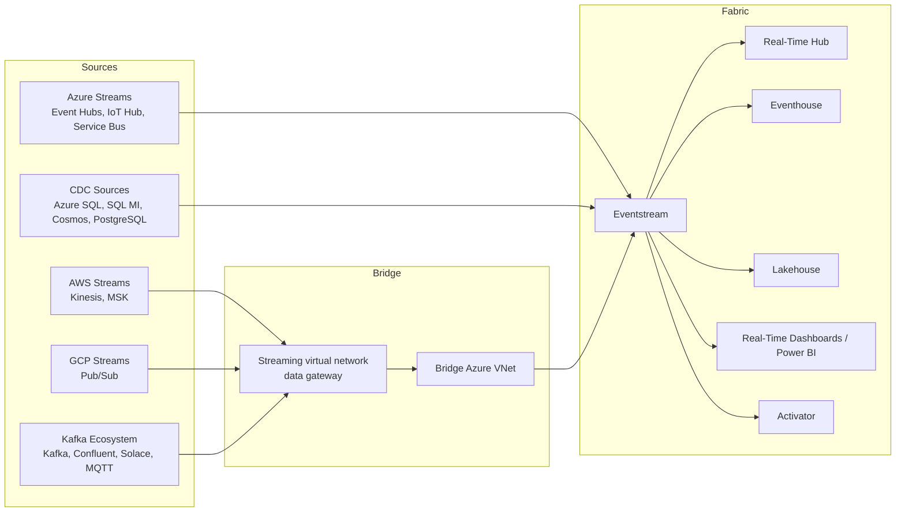

  
  
  

<h1 align="center">Cross-Cloud Streaming Comparison</h1>

  <strong>A decision guide for streaming ingestion into Microsoft Fabric across Azure, AWS, GCP, and Kafka-based ecosystems, with explicit treatment of private-network designs.</strong>

  <a href="#1-executive-summary">Executive Summary</a> •
  <a href="#2-streaming-pattern-grid">Pattern Grid</a> •
  <a href="#3-private-network-decision-rules">Private Network Rules</a> •
  <a href="#4-migration-bias">Migration Bias</a>

> **Version**: 1.0  
> **Date**: 2026-03-16  
> **Companion to**: [03-aws-connectivity.md](./03-aws-connectivity.md) | [04-gcp-connectivity.md](./04-gcp-connectivity.md) | [05-azure-connectivity.md](./05-azure-connectivity.md) | [09-azure-streaming-connectivity.md](./09-azure-streaming-connectivity.md)  

---

## 1. Executive Summary

Streaming should not be modeled with the same decision rules as classic semantic model refresh, import, or DirectQuery connectivity.

The architecture bias is:

1. Use **Fabric Eventstream** and **Real-Time Intelligence** for new streaming ingestion patterns.
2. Use native source connectors where they exist: **Azure Event Hubs**, **Azure IoT Hub**, **Azure Service Bus**, **Amazon Kinesis**, **Google Cloud Pub/Sub**, **Apache Kafka**, **Amazon MSK**, and related CDC/event sources.
3. For **private streaming sources**, prefer the new Eventstream-specific private networking pattern, not OPDG.
4. In Azure-centered private designs, use the preview **Streaming virtual network data gateway** to let Eventstream connectors run inside a bridge Azure VNet.
5. Treat legacy **Power BI streaming semantic models** and **Azure Stream Analytics to Power BI** as migration candidates, not target-state architecture.

The result is a simpler rule set: **Eventstream first, private bridge when needed, legacy push streaming only if you are carrying forward old implementations.**

## 2. Streaming Pattern Grid

| Provider / Source | Native Fabric streaming path | Private network pattern | Recommended design |
|---|---|---|---|
| Azure Event Hubs | Eventstream connector | Streaming virtual network data gateway or Private Link-supported Eventstream path | Eventstream first |
| Azure IoT Hub | Eventstream connector | Streaming virtual network data gateway or Private Link-supported Eventstream path | Eventstream first |
| Azure Service Bus | Eventstream connector | Streaming virtual network data gateway or Private Link-supported Eventstream path | Eventstream first |
| Azure SQL / SQL MI / Cosmos CDC | Eventstream CDC connector | Private Eventstream pattern depending on supported scenario | Eventstream for streaming change capture |
| AWS Kinesis | Eventstream connector | Streaming virtual network data gateway through Azure bridge VNet when source is private | Eventstream first |
| AWS MSK Kafka | Eventstream connector | Streaming virtual network data gateway through Azure bridge VNet when private | Eventstream first |
| GCP Pub/Sub | Eventstream connector | Streaming virtual network data gateway through Azure bridge VNet when private | Eventstream first |
| Apache Kafka / Confluent / Solace / MQTT | Eventstream connector | Streaming virtual network data gateway through Azure bridge VNet when private | Eventstream first |
| Legacy Power BI streaming model | Power BI streaming semantic model | No modern private-network answer beyond legacy constraints | Migrate away |

## 3. Cross-Cloud Architecture At A Glance

## 4. Private Network Decision Rules

### Use the streaming gateway path when

- the source is a streaming system or CDC source connected through Eventstream,
- the source is private in Azure, AWS, GCP, or on-premises,
- the connector runtime must be placed into a reachable network path, and
- the goal is real-time ingestion, not query/refresh connectivity.

### Do not use OPDG as the first answer when

- the workload is Eventstream-native,
- the source already has an Eventstream connector, and
- the only problem is source reachability from a private network.

### Keep VNet Data Gateway for classic Fabric connectivity when

- the workload is Power Query, semantic model refresh, Dataflow Gen2, or another standard connector-based batch or interactive path,
- the source is Azure private PaaS,
- and the scenario is not Eventstream ingestion.

## 5. Provider Notes

### Azure

- Strongest native alignment with Fabric.
- Can use both Eventstream native connectors and Eventstream private networking.
- Also the control plane for the bridge VNet used in the new streaming gateway pattern.

### AWS

- Public Kinesis and related sources can map directly to Eventstream where supported.
- Private AWS streaming sources should be routed through Azure using the bridge VNet pattern.
- This is cleaner than trying to force a streaming source into a classic OPDG-centric model.

### GCP

- Google Cloud Pub/Sub fits the same pattern as AWS Kinesis: native Eventstream connector first, bridge VNet when private.
- Keep this separate from BigQuery and Cloud SQL guidance, which are query-oriented rather than stream-ingestion-oriented.

### Kafka ecosystems

- Kafka, Confluent Cloud, Amazon MSK, Solace, and MQTT all fit the same streaming-first shape.
- Use Eventstream for ingestion and processing, then land the data in Eventhouse or Lakehouse depending on the analytical need.

## 6. Migration Bias

| Existing pattern | Target pattern |
|---|---|
| Azure Stream Analytics to Power BI | Eventstream to Eventhouse or Lakehouse, then Real-Time dashboards or Power BI |
| Push streaming semantic models | Eventstream and Real-Time Intelligence |
| Private streaming source with ad hoc custom bridge | Streaming virtual network data gateway |
| Power BI streaming tiles | Real-Time dashboards or Power BI on Eventhouse/Lakehouse-backed data |

## 7. Fast Decision Table

| Question | Best answer |
|---|---|
| Azure Event Hubs, public? | Eventstream direct |
| Azure Event Hubs, private? | Streaming virtual network data gateway or Private Link-supported Eventstream path |
| AWS Kinesis, public? | Eventstream direct |
| AWS Kinesis, private? | Streaming virtual network data gateway through Azure bridge VNet |
| GCP Pub/Sub, public? | Eventstream direct |
| GCP Pub/Sub, private? | Streaming virtual network data gateway through Azure bridge VNet |
| Kafka cluster in private network? | Streaming virtual network data gateway through Azure bridge VNet |
| Existing Power BI streaming dashboard? | Keep short term, plan migration |

## 8. Companion Map

| Need | Document |
|---|---|
| Azure streaming details | [09-azure-streaming-connectivity.md](./09-azure-streaming-connectivity.md) |
| Azure classic connector details | [05-azure-connectivity.md](./05-azure-connectivity.md) |
| AWS connectivity details | [03-aws-connectivity.md](./03-aws-connectivity.md) |
| GCP connectivity details | [04-gcp-connectivity.md](./04-gcp-connectivity.md) |
| Cross-cloud batch/query comparison | [06-cross-cloud-comparison.md](./06-cross-cloud-comparison.md) |