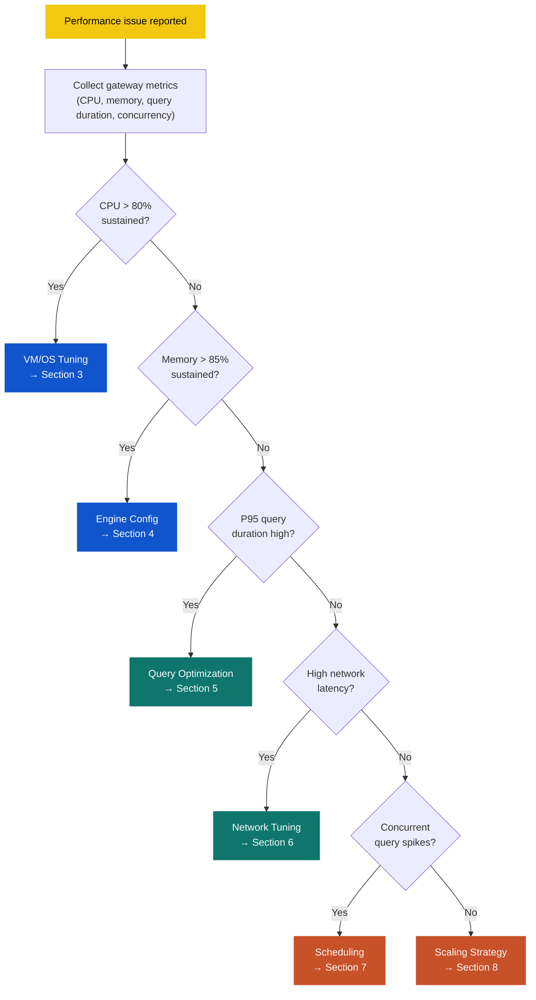

<p align="center">
    
    
    
</p>

<h1 align="center">Gateway Performance Optimization</h1>

<p align="center">
    <strong>Practical tuning guide for maximizing throughput, minimizing latency, and right-sizing gateway infrastructure across OPDG and VNet Data Gateways.</strong>
</p>

<p align="center">
    <a href="#1-executive-summary">Executive Summary</a> •
    <a href="#2-optimization-decision-framework">Framework</a> •
    <a href="#3-vm-and-os-level-tuning">VM Tuning</a> •
    <a href="#4-gateway-engine-configuration">Engine Config</a> •
    <a href="#5-query-and-workload-optimization">Query Optimization</a> •
    <a href="#6-network-optimization">Network</a> •
    <a href="#7-refresh-scheduling-optimization">Scheduling</a> •
    <a href="#8-scaling-strategies">Scaling</a> •
    <a href="#9-vnet-data-gateway-optimization">VNet Gateway</a> •
    <a href="#10-multi-cloud-source-optimization">Multi-Cloud</a> •
    <a href="#11-troubleshooting-performance-issues">Troubleshooting</a>
</p>

> **Version**: 1.0  
> **Date**: 2026-03-18  
> **Companion to**: [01-gateway-strategy.md](./01-gateway-strategy.md), [02-gateway-architecture.md](./02-gateway-architecture.md)  
> **Scope**: Performance tuning for OPDG clusters, VNet Data Gateways, and multi-cloud data source connectivity  

---

## Optimization At A Glance

| Topic | Summary |
|---|---|
| Primary goal | Reduce query duration, increase refresh throughput, and maintain gateway stability under production load |
| Tuning layers | VM resources → OS settings → gateway engine → query design → network path → scheduling |
| Key principle | Measure first, then tune — always validate changes against baseline metrics before applying broadly |
| Scaling direction | Prefer horizontal scaling (add nodes) over vertical scaling (bigger VMs) for production clusters |
| Biggest wins | Query folding, refresh staggering, AMQP transport, mashup container tuning, and right-sized VM disks |

> [!TIP]
> Read [02-gateway-architecture.md](./02-gateway-architecture.md) Section 6 for the monitoring stack and alert rules. This document assumes monitoring is already in place and focuses on what to tune once you have the data.

---

## 1. Executive Summary

Gateway performance problems rarely have a single root cause. They emerge from the interaction between VM resources, engine configuration, query design, network latency, and scheduling patterns. This document provides a structured, layered approach to optimization — starting from the infrastructure and working up to workload-level design.

The guidance applies to both **OPDG clusters** (Azure-hosted VMs) and **VNet Data Gateways** (Microsoft-managed), with explicit callouts where tuning options differ. Multi-cloud data sources (AWS, GCP, SaaS) introduce additional latency and driver considerations that are covered in [Section 10](#10-multi-cloud-source-optimization).

---

## 2. Optimization Decision Framework

Before tuning, identify which layer is the bottleneck. Use the following decision flow to prioritize effort:



> [!NOTE]
> Most production performance issues fall into one of three categories: insufficient query folding (Section 5), scheduling contention (Section 7), or undersized spooling disk (Section 3.3). Start there if you need a quick win.

---

## 3. VM and OS-Level Tuning

### 3.1 Right-Sizing Compute

The architecture document defines three VM profiles. Use the table below to determine when to move between tiers:

| Profile | VM SKU | vCPUs | RAM | When to use | Upgrade signal |
|---|---|---|---|---|---|
| Light | Standard_D4s_v5 | 4 | 16 GB | Non-prod, < 10 concurrent queries | CPU > 70% or memory > 75% sustained |
| Medium | Standard_D8s_v5 | 8 | 32 GB | Production analytics or dataflow | CPU > 80% or memory > 85% sustained |
| Heavy | Standard_D16s_v5 | 16 | 64 GB | High-concurrency production, large data volumes | Consider horizontal scaling instead |

> [!TIP]
> Vertical scaling beyond D16s_v5 rarely improves gateway throughput because the mashup engine has internal concurrency limits. Prefer adding cluster nodes at that point.

#### 3.1.1 VM SKU Deep Dive — Performance and Cost Characteristics

The Dsv5-series is the recommended family because it provides a balanced vCPU-to-memory ratio, supports Premium Storage, and includes Accelerated Networking at no extra cost. The table below compares the three tiers with networking and storage throughput caps that directly affect gateway performance.

| Attribute | D4s_v5 | D8s_v5 | D16s_v5 |
|---|---|---|---|
| **vCPUs** | 4 | 8 | 16 |
| **RAM** | 16 GB | 32 GB | 64 GB |
| **Max data disks** | 8 | 16 | 32 |
| **Max uncached disk throughput** | 250 MB/s | 500 MB/s | 800 MB/s |
| **Max uncached disk IOPS** | 6,400 | 12,800 | 25,600 |
| **Max burst disk IOPS** | 20,000 | 20,000 | 40,000 |
| **Max network bandwidth** | 12.5 Gbps | 12.5 Gbps | 12.5 Gbps |
| **Accelerated Networking** | Yes | Yes | Yes |
| **Recommended mashup containers** | 4–5 | 8–10 | 12–16 |
| **Practical concurrent refreshes** | 3–5 | 8–15 | 15–25 |
| **Typical workload** | Dev/test, light reporting | Production analytics or dataflow | High-volume ETL, heavy DirectQuery |

> [!NOTE]
> The **max uncached disk IOPS** cap applies to all data disks combined. If your spooling disk alone needs 5,000+ IOPS, the D4s_v5 can handle it, but you have less headroom for OS activity and logs. On D8s_v5 and above, you rarely hit the VM-level cap before the individual disk limit.

#### 3.1.2 Container-to-RAM Worked Examples

Each mashup container consumes approximately 2.5–3 GB of RAM at peak. The OS and gateway service itself require ~4 GB baseline. Use this formula to set `MashupDefaultPoolContainerMaxCount`:

```text
Max containers = floor((Total RAM - 4 GB OS overhead) / 3 GB per container)
```

| VM SKU | Total RAM | OS overhead | Available for containers | Recommended container count | Headroom |
|---|---|---|---|---|---|
| D4s_v5 | 16 GB | 4 GB | 12 GB | **4** (12 GB) | ~0 GB — tight; watch for paging |
| D8s_v5 | 32 GB | 4 GB | 28 GB | **8** (24 GB) | ~4 GB — comfortable |
| D16s_v5 | 64 GB | 4 GB | 60 GB | **14** (42 GB) | ~18 GB — room for burst and large single-query results |

> [!IMPORTANT]
> Setting containers higher than the recommended count causes memory pressure, page file swapping, and eventual `OutOfMemoryException` in mashup processes. If your workload needs more concurrency than the recommended count, **add a cluster node** instead of increasing the container count.

#### 3.1.3 When Vertical Scaling Doesn't Help

Know the ceilings. Vertical scaling fails to improve performance when:

| Scenario | Why bigger VMs won't help | What to do instead |
|---|---|---|
| CPU is low but queries are slow | Bottleneck is source-side query execution, not gateway compute | Optimize source queries (Section 5), add source-side indexes |
| Memory is available but refresh fails | Query result set exceeds max single-container allocation (~10 GB) | Use incremental refresh or partition the query |
| Going beyond D16s_v5 | Mashup engine concurrency plateaus; diminishing returns | Horizontal scaling (add nodes to the cluster) |
| Network is the constraint | VM SKU doesn't change ExpressRoute or VPN throughput | Upgrade the network link, or use shortcuts to bypass the gateway |

### 3.2 Memory Configuration

The gateway's mashup engine spawns **container processes** that each consume memory. Excess containers compete for RAM and cause paging.

**Key registry settings** (OPDG nodes):

| Setting | Location | Default | Recommended | Impact |
|---|---|---|---|---|
| `MashupDefaultPoolContainerMaxCount` | Gateway config (Microsoft.PowerBI.DataMovement.Pipeline.GatewayCore.dll.config) | 10 | 8–12 depending on RAM | Controls max mashup containers per node |
| `MashupDPUPoolContainerMaxCount` | Same config file | 10 | Scale with available cores | Controls DPU container pool size |
| `MashupTestConnectionPoolContainerMaxCount` | Same config file | 2 | 2 | Test connection containers; keep low |

**Sizing guideline**: Allocate approximately 2.5–3 GB of RAM per mashup container. For a 32 GB VM, target 8–10 containers maximum to leave headroom for the OS and gateway service.

### 3.3 Disk Configuration

The gateway spools query results to disk before transmitting to the Fabric service. Slow or full disks directly impact refresh duration and can cause failures.

| Disk aspect | Recommendation |
|---|---|
| **Disk type** | Premium SSD (P20 or higher) or Ultra Disk for spooling path |
| **Spooling path** | Move the spooling directory off the OS disk to a dedicated data disk |
| **Minimum free space** | Maintain > 30% free on the spooling volume at all times |
| **IOPS** | Target at least 2,300 IOPS for medium workloads; 5,000+ for heavy refresh loads |
| **Temp directory** | Set `TEMP` and `TMP` environment variables to the fast data disk |

#### 3.3.1 Azure Managed Disk Tier Comparison

Choosing the right disk tier is critical. The table below compares the managed disk tiers commonly used for gateway VM spooling paths.

| Disk tier | Size | Baseline IOPS | Baseline throughput | Burst IOPS | Burst throughput | Recommended for |
|---|---|---|---|---|---|---|
| **P10** (Premium SSD) | 128 GB | 500 | 100 MB/s | 3,500 | 170 MB/s | OS disk only; **not suitable for spooling** |
| **P15** (Premium SSD) | 256 GB | 1,100 | 125 MB/s | 3,500 | 170 MB/s | Non-prod spooling; light workloads |
| **P20** (Premium SSD) | 512 GB | 2,300 | 150 MB/s | 3,500 | 170 MB/s | Production — medium workloads |
| **P30** (Premium SSD) | 1 TB | 5,000 | 200 MB/s | 30,000 | 1,000 MB/s | Production — heavy workloads |
| **P40** (Premium SSD) | 2 TB | 7,500 | 250 MB/s | 30,000 | 1,000 MB/s | Extreme ETL with very large staging files |
| **Ultra Disk** | Configurable | Up to 160,000 | Up to 4,000 MB/s | N/A (sustained) | N/A (sustained) | Latency-critical or sustained high-IOPS workloads |

> [!NOTE]
> Premium SSD burst credits are finite. If your gateway sustains high IOPS for more than 30 minutes continuously (common during large Import refreshes), baseline IOPS — not burst — determines performance. Size accordingly.

#### 3.3.2 Disk Impact on Refresh Performance

Disk speed has a direct, measurable effect on refresh duration. When the mashup engine processes query results, it writes to the spooling directory in blocks. Slow writes block the pipeline and back-pressure the source query.

**Observed performance patterns**:

| Scenario | Data volume per refresh | P10 (OS disk) | P20 (dedicated) | P30 (dedicated) | Improvement |
|---|---|---|---|---|---|
| Small dataset | < 500 MB | ~2 min | ~1.5 min | ~1.4 min | Marginal — disk is not the bottleneck |
| Medium dataset | 500 MB – 5 GB | ~12 min | ~7 min | ~5.5 min | **40–55% faster** with dedicated disk |
| Large dataset | 5 GB – 20 GB | ~45 min | ~25 min | ~18 min | **44–60% faster**; P10 may timeout |
| Very large dataset | > 20 GB | Likely fails (disk full/timeout) | ~50 min | ~35 min | P10 **not viable**; P30 recommended |

> [!IMPORTANT]
> Using the OS disk (P10, 128 GB) for spooling is the single most common misconfiguration on gateway VMs. A dedicated P20 or P30 data disk is the highest-impact hardware change you can make.

#### 3.3.3 Disk and VM Tier Interaction

The VM SKU imposes an upper cap on total uncached disk IOPS and throughput, independent of the disk tier attached. If the disk can deliver more than the VM allows, the VM becomes the bottleneck.

```text
Effective IOPS = min(Disk baseline IOPS, VM max uncached IOPS)
Effective throughput = min(Disk baseline throughput, VM max uncached throughput)
```

| Combination | Disk IOPS | VM max IOPS | Effective IOPS | Bottleneck |
|---|---|---|---|---|
| D4s_v5 + P20 | 2,300 | 6,400 | 2,300 | Disk |
| D4s_v5 + P30 | 5,000 | 6,400 | 5,000 | Disk |
| D8s_v5 + P30 | 5,000 | 12,800 | 5,000 | Disk |
| D8s_v5 + P40 | 7,500 | 12,800 | 7,500 | Disk |
| D16s_v5 + P30 | 5,000 | 25,600 | 5,000 | Disk |
| D4s_v5 + Ultra (10,000) | 10,000 | 6,400 | 6,400 | **VM** — need a bigger SKU to utilise Ultra fully |

> [!TIP]
> For most production workloads, a **D8s_v5 + P30** combination provides the best balance: 5,000 baseline IOPS with burst to 30,000, 500 MB/s VM throughput cap, and enough headroom for concurrent spool writes. Reserve Ultra Disk or P40 for proven extreme throughput needs.

#### 3.3.4 Recommended Disk Layout Per VM Profile

| Profile | VM SKU | OS Disk | Data Disk (Spooling) | Total disk cost (approx.) |
|---|---|---|---|---|
| Non-prod | D4s_v5 | P10 (128 GB) | P15 (256 GB) | Low |
| Production — Medium | D8s_v5 | P10 (128 GB) | P20 (512 GB) | Moderate |
| Production — Heavy | D8s_v5 | P10 (128 GB) | P30 (1 TB) | Moderate-High |
| Production — Extreme | D16s_v5 | P10 (128 GB) | P30 (1 TB) or P40 (2 TB) | High |

**How to move the spooling directory**:

1. Stop the On-premises data gateway service.
2. Edit `Microsoft.PowerBI.DataMovement.Pipeline.GatewayCore.dll.config`.
3. Update the `SpoolingFolderPath` value to the new data disk path (e.g., `E:\GatewaySpooling`).
4. Start the gateway service.
5. Validate connectivity for all data sources.
6. Monitor the new disk for IOPS and free space in Azure Monitor.

### 3.4 OS-Level Settings

| Setting | Action | Why |
|---|---|---|
| **Power plan** | Set to **High Performance** | Prevents CPU throttling under load |
| **Windows page file** | Set to system-managed on the data disk | Avoids OS disk contention for paging |
| **Antivirus exclusions** | Exclude the gateway install directory, spooling path, and `%TEMP%` | AV scanning during spool writes adds latency |
| **Windows Update** | Use WSUS or Update Management with a maintenance window | Avoid unexpected reboots during business hours |
| **.NET garbage collection** | Confirm `<gcServer enabled="true"/>` in the gateway config | Server GC mode improves throughput for multi-threaded workloads |

---

## 4. Gateway Engine Configuration

### 4.1 Mashup Container Tuning

The mashup engine is the core query execution component. Each query runs inside an isolated container process. Tuning container lifecycle and pooling directly affects concurrency and memory.

| Parameter | Location | Default | Tuning guidance |
|---|---|---|---|
| `MashupDefaultPoolContainerMaxCount` | GatewayCore config | 10 | Reduce to 6–8 on memory-constrained nodes; increase to 12–14 on D16s_v5 with 64 GB |
| `MashupDefaultPoolContainerMaxIdleTimeInSeconds` | GatewayCore config | 120 | Decrease to 60 for bursty workloads to free memory faster |
| `ConnectionPoolingEnabled` | GatewayCore config | true | Keep enabled; disabling causes new TCP connections per query |

### 4.2 Query Timeout Settings

| Timeout | Default | Recommendation | Impact |
|---|---|---|---|
| **Gateway-level timeout** | 10 min | Increase to 20 min for large import refreshes | Prevents premature timeout for expected long queries |
| **Data source query timeout** | Varies by connector | Set explicitly per connection | Avoids open-ended queries that consume containers |
| **Fabric dataset refresh timeout** | 2 hours | Adjust in dataset settings if refreshes legitimately take longer | The gateway timeout and the dataset timeout are independent |

> [!NOTE]
> If a single query consistently exceeds the timeout, the solution is rarely to increase the timeout further. Instead, optimize the query (Section 5) or redesign the dataflow to process smaller partitions.

### 4.3 Transport Protocol

The gateway communicates with Azure Service Bus using either **HTTPS (443)** or **AMQP (5671–5672)**.

| Protocol | Port | Throughput | Best for |
|---|---|---|---|
| HTTPS | 443 | Good | Restrictive firewalls, small payloads |
| AMQP | 5671–5672 | Higher (persistent connection, binary framing) | Production clusters with high query volume |

**How to force AMQP**: Open firewall ports 5671–5672 outbound to `*.servicebus.windows.net`. The gateway will automatically prefer AMQP when these ports are reachable. No configuration change is needed on the gateway itself.

> [!TIP]
> AMQP reduces overhead for high-frequency query patterns (DirectQuery, live connection). If your firewall team can open these ports, this is one of the easiest performance wins.

### 4.4 Logging Level

Excessive logging consumes disk I/O and CPU. Adjust based on need:

| Level | When to use | Performance impact |
|---|---|---|
| **None** | Not recommended | — |
| **Error** | Stable production with no active issues | Minimal |
| **Warning** | Default production setting | Low |
| **Verbose** | Active troubleshooting only | High — disable after investigation |

To change: Open the On-premises data gateway app → Diagnostics → adjust the slider → restart.

---

## 5. Query and Workload Optimization

### 5.1 Query Folding

Query folding is the single most impactful optimization for gateway performance. When a query folds, the mashup engine pushes transformations (filters, aggregations, joins) down to the source database instead of pulling raw data through the gateway and transforming it in memory.

**How to verify folding**:
1. Open the dataset in Power BI Desktop.
2. In the Power Query Editor, right-click a step and select **View Native Query**.
3. If a native query appears, that step folds. If the option is greyed out, folding broke at a previous step.

**Common folding breakers**:

| Transformation | Folds? | Alternative |
|---|---|---|
| Filter rows | Yes | — |
| Remove columns | Yes | — |
| Group by | Yes | — |
| Merge queries (same source) | Yes | — |
| Merge queries (cross source) | No | Use a database view or staging table instead |
| Add custom column with M logic | No | Use a computed column in the source or a database view |
| Pivot / Unpivot | Sometimes | Test; if it doesn't fold, move to the source |
| Change type (complex) | Sometimes | Keep type changes late in the query chain |
| Sort rows | Yes (but may add ORDER BY overhead) | Remove sorts unless needed for Top N |
| Buffer table | No | Remove `Table.Buffer` unless resolving a specific re-read issue |

> [!IMPORTANT]
> Every step that breaks folding forces the gateway to download the full upstream result set and process it locally. For large tables, this is the number one cause of slow refreshes and high memory/CPU on gateway nodes.

### 5.2 Import vs DirectQuery Considerations

| Mode | Gateway impact | Optimization focus |
|---|---|---|
| **Import** | High burst load during scheduled refresh, then idle | Stagger refresh schedules; optimize query folding; use incremental refresh |
| **DirectQuery** | Continuous query load during user interaction | Minimize query complexity; use aggregations; tune query caching on the dataset |
| **Composite** | Mix of both patterns | Ensure high-volume tables are Import with incremental refresh; keep only real-time tables in DQ |

### 5.3 Incremental Refresh

For large Import tables, incremental refresh dramatically reduces the data volume processed per refresh cycle.

**Impact on gateway**:
- Only changed/new partitions are refreshed, reducing query duration and memory usage.
- The `RangeStart` and `RangeEnd` parameters must fold to the source; use a date/datetime column with a native filter.

**Setup checklist**:
1. Ensure the partition column is a date or datetime type in the source.
2. Confirm the filter on `RangeStart` / `RangeEnd` folds (native query visible).
3. Set the incremental window to match the data change pattern (e.g., last 7 days refresh, 3 years store).
4. Enable **detect data changes** with a watermark column if the source supports it.

### 5.4 Aggregations and Composite Models

Use Power BI aggregation tables to reduce DirectQuery hit rate on the gateway:

1. Create a pre-aggregated Import table for common grain levels (day, week, product category).
2. Define aggregation mappings in the model so Power BI serves queries from the cache when possible.
3. Only fall through to DirectQuery for detail-level or unusual dimension combinations.

This can reduce gateway DirectQuery volume by 70–90% for typical dashboard workloads.

### 5.5 Dataflow Optimization

| Technique | Benefit |
|---|---|
| **Use staging dataflows** | Separate extract (gateway-bound) from transform (compute engine) to reduce gateway time |
| **Enable the enhanced compute engine** | Allows folding of joins and aggregations to the Fabric compute instead of the gateway |
| **Reduce column count** | Select only needed columns early in the query; reduces data volume through the gateway |
| **Partition large tables by date** | Process manageable chunks; recover from failures without re-processing everything |

---

## 6. Network Optimization

### 6.1 Proximity and Latency

| Rule | Detail |
|---|---|
| Gateway cluster region must match Fabric capacity region | Cross-region routing adds 20–100 ms per round trip and can cause timeout cascading |
| Place gateways as close to data sources as possible | If Oracle is in a European data center, the gateway cluster should be in North Europe rather than East US |
| Use ExpressRoute over VPN for large data volumes | ExpressRoute provides consistent bandwidth and lower jitter; S2S VPN is acceptable for light workloads |

### 6.2 DNS Resolution

Slow DNS resolution adds latency to every gateway query. Ensure:

- DNS servers are in the same region as the gateway VMs.
- Forward lookups for data source hostnames resolve in < 5 ms.
- Private DNS zones are correctly linked to the gateway VNet (for Private Link / VNet Gateway scenarios).
- Consider DNS caching on the gateway VM if resolution times are inconsistent.

### 6.3 TCP Tuning

For high-throughput scenarios (large Import refreshes over ExpressRoute or VPN):

| Setting | Default | Recommended | How to set |
|---|---|---|---|
| TCP window scaling | Enabled | Verify enabled | `netsh interface tcp show global` |
| Receive-side scaling (RSS) | Depends on NIC | Enable if available | `netsh interface tcp set global rss=enabled` |
| Chimney offload | Disabled (deprecated) | Leave disabled | — |
| Max SYN retransmissions | 2 | Keep default | Changing this rarely helps gateway scenarios |

### 6.4 Bandwidth Planning

| Workload type | Typical bandwidth per node | Sizing guidance |
|---|---|---|
| Light (< 10 refresh/hour) | 50–200 Mbps burst | Standard VM networking sufficient |
| Medium (10–50 refresh/hour) | 200–500 Mbps burst | Verify VM SKU supports Accelerated Networking |
| Heavy (> 50 refresh/hour or large datasets) | 500 Mbps–2 Gbps burst | Use VMs with Accelerated Networking enabled; consider ExpressRoute Direct for sustained throughput |

> [!TIP]
> Enable **Accelerated Networking** on all gateway VMs. It's free, reduces latency by offloading network flow to the NIC hardware, and is supported on all Dsv5-series VMs.

---

## 7. Refresh Scheduling Optimization

### 7.1 Staggering Refreshes

Concurrent refreshes competing for mashup containers, CPU, and network bandwidth is the most common cause of intermittent gateway slowness.

**Staggering strategy**:

| Approach | Implementation |
|---|---|
| **Offset start times** | Spread refreshes across 5–10 minute intervals instead of scheduling everything at HH:00 or HH:30 |
| **Priority scheduling** | Schedule business-critical datasets first (e.g., 06:00), then secondary datasets (e.g., 06:15, 06:30) |
| **Off-peak for heavy loads** | Schedule large Import refreshes outside business hours to avoid competing with DirectQuery traffic |
| **Use Fabric Pipeline orchestration** | Chain refreshes sequentially or with controlled parallelism via Fabric Data Pipelines |

### 7.2 Refresh Window Planning

```mermaid
gantt
    title Optimized Refresh Schedule — Gateway Cluster
    dateFormat HH:mm
    axisFormat %H:%M

    section Critical Datasets
    Finance Dashboard        :crit, 06:00, 15min
    Sales Pipeline           :crit, 06:15, 20min
    Executive Scorecard      :crit, 06:40, 10min

    section Standard Datasets
    Operational Report A     :07:00, 25min
    Operational Report B     :07:30, 20min
    Inventory Tracker        :08:00, 15min

    section Heavy ETL
    Data Warehouse Refresh   :02:00, 90min
    Historical Load          :03:30, 60min
```



### 7.3 Monitoring Refresh Overlap

Use the gateway logs in Log Analytics to identify refresh collisions:

```kusto
GatewayLogs
| where OperationName == "QueryExecution"
| summarize ConcurrentQueries = count() by bin(TimeGenerated, 5m)
| where ConcurrentQueries > 20
| order by TimeGenerated asc
```

When `ConcurrentQueries` consistently exceeds the mashup container count, you have scheduling contention. Reschedule or add nodes.

---

## 8. Scaling Strategies

### 8.1 Horizontal vs Vertical Scaling

| Strategy | When to choose | Advantages | Disadvantages |
|---|---|---|---|
| **Horizontal** (add nodes) | Concurrency is the bottleneck; CPU/memory distributed | HA improvement; linear throughput gain; can scale in/out | More VMs to manage; all nodes need identical driver stack |
| **Vertical** (bigger VM) | Single-query performance is the bottleneck; memory pressure from large datasets | Simpler management; immediate capacity boost | Diminishing returns past D16s_v5; single point of failure if one node |

**Decision rule**: If average CPU per node is < 50% but concurrent query count is high, scale horizontally. If average CPU per node is > 80% but query count is low, scale vertically.

### 8.2 Cluster Node Balancing

The OPDG Service Bus relay distributes queries across cluster nodes using round-robin. There is no workload-aware routing. To ensure balanced distribution:

- Keep all nodes on the **same VM SKU and disk tier**.
- Maintain an **identical driver stack** across all nodes (same Oracle client version, same ODBC drivers).
- Update gateway versions using **rolling updates** (one node at a time) to eliminate version skew.
- If one node consistently shows higher load, check whether its Service Bus connection is healthy.

### 8.3 Auto-Scaling Patterns

While OPDG doesn't natively support auto-scaling, you can implement a scheduled scaling pattern:

| Time window | Node count | Reason |
|---|---|---|
| 02:00–06:00 (ETL window) | 3 nodes (full cluster) | Heavy refresh workloads |
| 06:00–18:00 (business hours) | 3 nodes (full cluster) | DirectQuery + scheduled refresh overlap |
| 18:00–02:00 (off-hours) | 2 nodes (reduced) | Low query volume; cost savings |

> [!NOTE]
> Scaling down requires gracefully draining a node (stop the gateway service, let in-flight queries complete). Automate this via Azure Automation or a scheduled task that stops the service and optionally deallocates the VM.

---

## 9. VNet Data Gateway Optimization

VNet Data Gateways are Microsoft-managed and offer fewer tuning levers, but you can still optimize the workload hitting them.

### 9.1 What You Can Control

| Area | Action |
|---|---|
| **Query design** | All query folding guidance (Section 5) applies fully |
| **Incremental refresh** | Reduces processed data per refresh cycle |
| **Connection count** | Limit concurrent connections to the VNet gateway to avoid throttling |
| **Subnet sizing** | Use a `/28` subnet (16 IPs) dedicated to the VNet gateway; avoid IP exhaustion from shared workloads |
| **Private DNS** | Ensure `privatelink.postgres.database.azure.com` and other private DNS zones resolve correctly from the delegated subnet |

### 9.2 What You Cannot Control

| Area | Detail |
|---|---|
| Compute sizing | Microsoft manages the container; you cannot change CPU or RAM |
| Container count | Managed by the service; scales within tenant limits |
| Transport protocol | Managed internally |
| Disk throughput | Managed by the service |

### 9.3 When to Shift to OPDG

If VNet Data Gateway performance is insufficient and you've exhausted query-side optimizations, consider routing the workload through OPDG instead. Signals to watch:

- Consistent query timeouts with no query folding issues.
- Throttling responses from the VNet gateway (visible in Fabric Admin monitoring).
- Reaching the tenant limit of 5 VNet gateways and needing additional throughput.

---

## 10. Multi-Cloud Source Optimization

### 10.1 AWS Sources

| Source | Optimization | Detail |
|---|---|---|
| **Redshift** | Use `UNLOAD` for large exports | For very large tables, extract to S3 via `UNLOAD` and use an S3 shortcut instead of querying Redshift through the gateway |
| **Redshift** | Enable result caching | `SET enable_result_cache_for_session TO on;` reduces repeat query latency |
| **S3** | Use shortcuts where possible | S3 shortcuts bypass the gateway entirely for supported Fabric workloads |
| **Athena** | Partition tables | Partitioned Athena tables reduce scan volume (and cost) per ODBC query through the gateway |
| **RDS (PostgreSQL/MySQL)** | Connection pooling on the source | Use PgBouncer or ProxySQL in front of RDS to handle connection surges from gateway containers |

### 10.2 GCP Sources

| Source | Optimization | Detail |
|---|---|---|
| **BigQuery** | Use BI Engine reservation | Accelerates interactive queries; reduces time the gateway waits for BigQuery response |
| **BigQuery** | Reduce query result size | Apply filters and aggregations in the BigQuery view; avoid pulling raw fact tables through the gateway |
| **Cloud SQL** | Read replicas | Point the gateway at a read replica to avoid impacting the primary |
| **GCS** | Use shortcuts where supported | Similar to S3, GCS shortcuts bypass the gateway for OneLake ingestion |

### 10.3 SaaS Sources

| Source | Optimization | Detail |
|---|---|---|
| **Snowflake** | Use the native connector (direct) | Snowflake's native connector doesn't require a gateway for public endpoints; avoid routing through OPDG unnecessarily |
| **Snowflake** | Warehouse sizing | Auto-suspend and right-size the Snowflake virtual warehouse to match Fabric refresh patterns |
| **Databricks** | Use the native connector | Databricks on Azure and public endpoints on AWS/GCP support direct connectivity |
| **Databricks** | Optimize cluster startup | If using on-demand clusters, account for cold-start time in refresh scheduling; consider always-on pools for critical refreshes |

### 10.4 Cross-Cloud Latency Budget

When the data source is in another cloud, the total query latency includes multiple hops:

```text
Total latency = Source query time
              + Source → Gateway network transit (VPN/internet)
              + Gateway processing time (mashup engine)
              + Gateway → Fabric Service Bus relay
              + Fabric processing time
```

**Mitigation strategies**:

| Hop | Mitigation |
|---|---|
| Source query time | Query folding, source-side indexing, caching, materialized views |
| Source → Gateway transit | Use ExpressRoute or Direct Connect where available; minimize payload with column pruning and filters |
| Gateway processing | Mashup container tuning, server GC, fast spooling disk |
| Gateway → Fabric relay | AMQP transport, regional proximity |

---

## 11. Troubleshooting Performance Issues

### 11.1 Diagnostic Checklist

| Symptom | Check first | Likely cause | Fix section |
|---|---|---|---|
| Refresh takes 3× longer than usual | Concurrent query count at refresh time | Scheduling contention | [Section 7](#7-refresh-scheduling-optimization) |
| Refresh fails with timeout | Query duration in gateway logs | Poor query folding or source slowness | [Section 5](#5-query-and-workload-optimization) |
| Gateway VM CPU pegged at 100% | Number of mashup containers | Too many containers for VM size | [Section 3](#3-vm-and-os-level-tuning) |
| Gateway VM memory > 90% | Container count and per-container allocation | Container pool oversized for available RAM | [Section 4](#4-gateway-engine-configuration) |
| DirectQuery responses > 10s | Source query execution plan | Missing indexes or filter pushdown failure | [Section 5.1](#51-query-folding) |
| Intermittent connectivity errors | Gateway logs for Service Bus reconnects | AMQP port blocked; falling back to HTTPS under load | [Section 4.3](#43-transport-protocol) |
| Disk full errors during refresh | Spooling directory free space | Spooling on OS disk or undersized data disk | [Section 3.3](#33-disk-configuration) |
| Refresh slow despite low CPU/memory | Disk IOPS in Azure Monitor during refresh window | Disk tier too low (e.g. P10/P15 under sustained load) | [Section 3.3.2](#332-disk-impact-on-refresh-performance) |
| VM IOPS capped despite fast disk | VM uncached IOPS counter at ceiling | VM SKU throttling disk throughput | [Section 3.3.3](#333-disk-and-vm-tier-interaction) |
| Uneven load across cluster nodes | Per-node metrics comparison | Version skew, driver mismatch, or unhealthy Service Bus connection | [Section 8.2](#82-cluster-node-balancing) |

### 11.2 Gateway Log Analysis Queries

**Top 10 slowest queries in the past 24 hours**:

```kusto
GatewayLogs
| where TimeGenerated > ago(24h)
| where OperationName == "QueryExecution"
| extend DurationMs = tolong(DurationMs)
| top 10 by DurationMs desc
| project TimeGenerated, DataSource, QueryTrackingId, DurationMs, Status
```

**Mashup container memory usage trend**:

```kusto
Perf
| where ObjectName == "Process" and CounterName == "Working Set - Private"
| where InstanceName startswith "mashup"
| summarize AvgMemoryMB = avg(CounterValue) / 1048576 by bin(TimeGenerated, 15m)
| render timechart
```

**Refresh failure correlation with concurrency**:

```kusto
let failures = GatewayLogs
| where OperationName == "QueryExecution" and Status == "Failed"
| summarize FailureCount = count() by bin(TimeGenerated, 15m);
let concurrency = GatewayLogs
| where OperationName == "QueryExecution"
| summarize ConcurrentQueries = count() by bin(TimeGenerated, 15m);
failures
| join kind=inner concurrency on TimeGenerated
| project TimeGenerated, FailureCount, ConcurrentQueries
| render columnchart
```

### 11.3 Escalation Path

| Level | Trigger | Action |
|---|---|---|
| **L1 — Self-service** | Single refresh slow or failed | Check query folding, refresh schedule, spooling disk |
| **L2 — Gateway Admin** | Multiple datasets affected, cluster-wide symptom | Review cluster metrics, container tuning, node health |
| **L3 — Microsoft Support** | Suspected platform issue, VNet gateway throttling, Service Bus relay errors | Open a support ticket with gateway diagnostics export and Log Analytics query results |

---

## 12. Optimization Checklist

Use this checklist during gateway deployment or periodic health reviews:

| # | Area | Item | Done? |
|---|---|---|---|
| 1 | VM | Power plan set to High Performance | ☐ |
| 2 | VM | Premium SSD P20+ or Ultra Disk for spooling path | ☐ |
| 3 | VM | Spooling directory moved off OS disk | ☐ |
| 4 | VM | Disk tier ≥ P20 for production; P30 for heavy workloads (Section 3.3.1) | ☐ |
| 5 | VM | Antivirus exclusions configured | ☐ |
| 6 | VM | Accelerated Networking enabled | ☐ |
| 7 | VM | VM-to-disk IOPS ceiling verified (Section 3.3.3) | ☐ |
| 8 | Engine | Mashup container count sized to available RAM (Section 3.1.2) | ☐ |
| 9 | Engine | Server GC enabled in gateway config | ☐ |
| 8 | Engine | Connection pooling enabled | ☐ |
| 9 | Network | AMQP ports 5671–5672 open outbound | ☐ |
| 10 | Network | Gateway region matches Fabric capacity region | ☐ |
| 11 | Network | DNS resolution < 5 ms for all source hostnames | ☐ |
| 12 | Query | Query folding verified for all Import datasets | ☐ |
| 13 | Query | Incremental refresh enabled for large tables | ☐ |
| 14 | Query | Aggregation tables defined for high-traffic DQ models | ☐ |
| 15 | Schedule | Refreshes staggered (no more than 3 concurrent per cluster) | ☐ |
| 16 | Schedule | Heavy ETL scheduled outside business hours | ☐ |
| 17 | Scaling | Cluster has ≥ 2 nodes for production | ☐ |
| 18 | Scaling | All nodes on identical VM SKU, driver stack, and gateway version | ☐ |
| 19 | Monitoring | Baseline metrics captured before tuning changes | ☐ |
| 20 | Monitoring | Alerts configured per Section 6.3 of architecture doc | ☐ |
| 21 | Monitoring | Disk IOPS and free space alerts on spooling volume | ☐ |

---

## 13. Summary — Optimization Priority Matrix

| Priority | Category | Action | Expected impact |
|---|---|---|---|
| **P1 — Quick wins** | Query | Enable query folding for all Import datasets | 50–80% reduction in gateway data processing |
| **P1 — Quick wins** | Schedule | Stagger refresh start times | Eliminates concurrency spikes |
| **P1 — Quick wins** | Disk | Move spooling to dedicated Premium SSD (P20+) | 40–60% faster spool writes for medium/large datasets |
| **P1 — Quick wins** | VM | Right-size mashup container count to RAM (Section 3.1.2) | Prevents OOM and page file thrashing |
| **P2 — Standard tuning** | VM | Upgrade disk tier from P15 → P30 for heavy production workloads | Baseline 5,000 IOPS with burst to 30,000 |
| **P2 — Standard tuning** | Engine | Right-size mashup container pool | Stabilizes memory; prevents OOM failures |
| **P2 — Standard tuning** | Network | Enable AMQP transport | 10–20% throughput improvement for high-frequency queries |
| **P2 — Standard tuning** | Network | Enable Accelerated Networking | Reduces VM-level network latency |
| **P3 — Advanced** | Query | Implement incremental refresh | Reduces large table refresh time by 70–90% |
| **P3 — Advanced** | Query | Add aggregation tables for DQ models | Reduces gateway DQ traffic by 70–90% |
| **P3 — Advanced** | Scaling | Add cluster nodes for horizontal scaling | Linear throughput increase |
| **P4 — Situational** | Multi-cloud | Use shortcuts to bypass gateway (S3, GCS, ADLS) | Eliminates gateway involvement entirely |
| **P4 — Situational** | Multi-cloud | Optimize source-side (indexes, caching, read replicas) | Reduces source query time |
